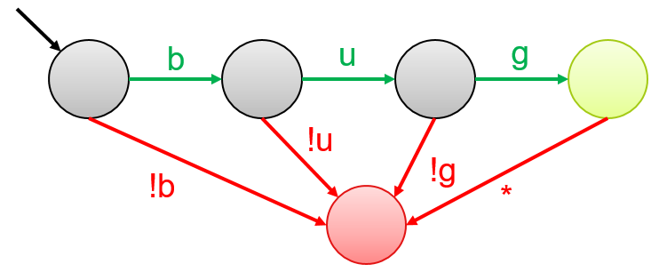
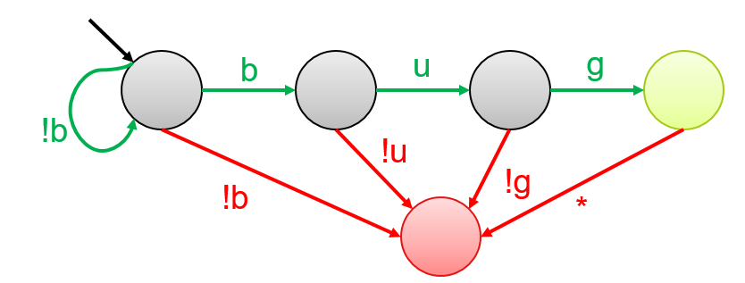
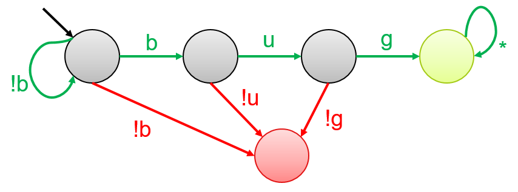

# 6.1 Static testing

Static testing analyses the code characteristics without executing the application. It can be considered as an automated code review. It checks the style and structure of the code, and can be used to _statically_ evaluate all possible code paths in the System Under Test (SUT).
Static analysis can quickly find _low-hanging fruit_ bugs that can be found in the source code, e.g. using deprecated functions. Static analysis tools are scalable and generally require less time to set up. _PMD_, _Checkstyle_, _Checkmarx_ are some common static analysis tools.

The classical approach underlying static analysis is checking the code for potential structural and/or stylistic rule violations. A code checker typically contains a parser and an acceptable rule set. We look at the following techniques for static analysis:

1. Pattern matching via *Regular expressions*
2. Syntax analysis via *Abstract Syntax Trees*


## Pattern matching

Pattern matching is a code checking approach that searches for pre-defined patterns in code. A common way to represent a pattern is via **regular expressions** or RegEx. Simply put, a regex engine reads input character-by-character and upon every character-match, progresses through the regular expression until no more characters remain. In case a match cannot be found, the regex engine backtracks and tries alternate paths to find a match. Depending on the logic, either a positive/negative reaction is returned indicating whether a match was found or not, or all matching inputs are returned.

An easy way to visualize a regular expression is via ***Finite State Automaton***. Each _node_ represents a state. We move from one state to the next by taking the _transition_ that matches the input symbol. Below you see a few examples of regular expressions and their corresponding finite state automata. The node with a black arrow is called the _starting state_. _Green states_ are accepting states. Any state other than accepting states is a rejecting state, e.g. _red_ and _gray states_ are rejecting states in the examples below. Note that while traversing the automaton, if the final state is not an accepting state, the string is considered rejected.

The automaton for the regular expression '**bug**' is shown below. `.` is a wildcard character that can match any possible character. An input string `bug` will transition from left to right, until we end up in the green state. However, the string `bag` will move from first state to the second state, and then to the red state. Since there is no transition out of this state, we will stay here until the input finishes. Similarly, the string `bu` will also be rejected since its final state is not a green state.





The regular expression '**.\*bug**' results in the following automaton. Again, `.` matches any possible character, and `*` denotes *0 or many times*. Hence, the regex accepts any string that ends in _bug_. The following strings will be accepted by this pattern: `bug`, `this is a bug`, `bad bug`, and `bugbug`. `bug!` will be rejected by this pattern. Note that this is a non-deterministic automata since there are two possible transitions for the symbol `b` in the first state.





The automaton for '**.\*bug.\***' is given below. It will accept any string that contains `b`, `u`, `g` consecutively, at least once. In this case, even `bug!` will be accepted.




While regular expressions are a fast and powerful pattern matching technique, their biggest limitation is that they do not take semantics into account, ending up with many matches that are not meaningful. For example, consider the following code snippet. Suppose that the regular expression, `\s*System.out.println\(.*\);`, searches for all print statements in the code to remove them before deployment. It will find three occurrences in the code snippet, which are all meaningless because the code is already disabled by a flag.

```java
boolean DEBUG = false;

if (DEBUG){
  System.out.println("Debug line 1");
  System.out.println("Debug line 2");
  System.out.println("Debug line 3");
}
```

## Syntax analysis

A more advanced code checking approach is syntax analysis. It works by deconstructing the input into a stream of characters, that are eventually turned into a Parse Tree. _Tokens_ are hierarchical data structures that are put together according to the code's logical structure.


A **Parse Tree** is a concrete instantiation of the code, where each character is explicitly placed in the tree, whereas an **Abstract Syntax Tree (AST)** is an abstract version of the parse tree in which syntax-related characters, such as semi-colon and parentheses, are removed. An example of the AST of the code snippet above is given below.


A static analysis tool using syntax analysis takes as input (a) an AST, and (b) a rule-set, and raises an alarm in case a rule is violated.
For example, for a rule _allowing at most 3 methods_, and the following code snippet, the AST will be parsed and an error will be raised for violating the rule. Contrarily, a very complicated regular expression would be needed to handle the varying characteristics of the four available methods, potentially resulting in mistakes.


Abstract Syntax Trees are used by compilers to find semantic errors &mdash; compile-time errors associated to the _meaning_ of the program. ASTs can also be used for program verification, type-checking, and translating the program from one language to another.  

## Performance of static analysis

 Theoretically, static analysis produces _sound_ results, i.e. zero false negatives. This is because a static analysis tool has access to the whole codebase, and it can track all the possible execution paths a program might take. So, if there are _any_ vulnerabilities, the tool should be able to find them. However, this comes at the cost of _Completeness_. Because it tracks all possible execution paths without seeing how the application behaves in action, some of the results might never be reached in an actual execution scenario, resulting in false positives.

 >Note that in practice, static analysis tools _can produce unsound results_, e.g. if a piece of code is added at runtime, since the tool will fail to see the new code-piece. This is one reason why the results of static analysis cannot always be trusted, especially in a security context.  


 _Soundness_ and _Completeness_ are defined more extensively in the Security testing chapter. 

## Exercises

**Exercise 1.** Regular expressions _CANNOT DO_ which of the following tasks?
1. Matching patterns
2. Detect semantics
3. Define wild cards
4. Detect coding mistakes

**Exercise 2.** Given that a static analysis tool has access to the entire codebase prior to execution, what is the quality of results that the tool will produce?
1. Sound and Complete
2. Sound but Incomplete
3. Unsound but Complete
4. Unsound and Incomplete

**Exercise 3.** Create an Abstract Syntax Tree for the following code snippet:
```java
(a + b) * (c - d)
```


## References

* Grune, D., Van Reeuwijk, K., Bal, H.E., Jacobs, C.J. and Langendoen, K., 2012. Modern compiler design. Springer Science & Business Media.
* Abstract Syntax Trees. https://en.wikipedia.org/wiki/Abstract_syntax_tree
* Semantic analysis. https://www.cs.usfca.edu/~galles/cs414S05/lecture/old2/lecture7.java.pdf
* Regular expressions in Java. https://www.tutorialspoint.com/java/java_regular_expressions.htm
