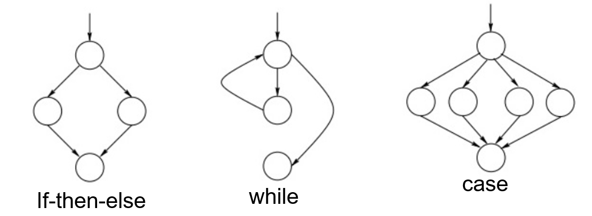
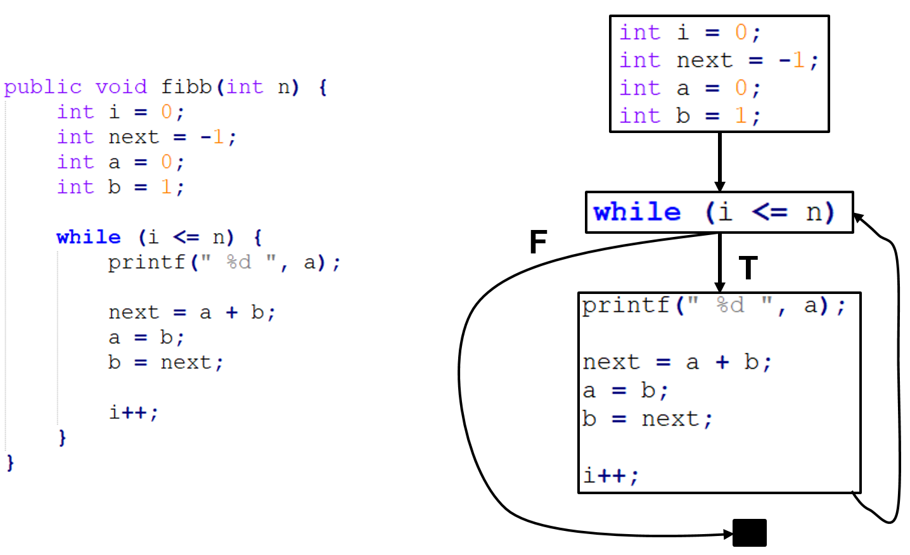

# Security Testing

[comment]: <> (TODO: replace application/app with software)

In May of 2018, a [Code Injection Vulnerability was discovered in the Desktop Signal app](https://ivan.barreraoro.com.ar/signal-desktop-html-tag-injection/). An attacker could execute code on a victim's machine by sending a specially crafted message: The victim's app would hand over the `/etc/passwd` file, and even send all the chats in plain text, _without any human intervention_! This was ironic since Signal is known for its end-to-end encryption feature.

<p align="center">
  
</p>

Why did this vulnerability exist, and how we could have avoided it? In this chapter, we answer these questions and introduce the concept of security testing.

After reading this chapter, you should be able to:
- Explain the key difference between traditional software testing and security testing,
- Understand the cause of security vulnerabilities in Java applications,
- Implement the Secure Software Development Life Cycle,
- Explain the various facets of Security Testing,
- Evaluate the key differences between SAST and DAST.

# Software vs. Security testing

We start this chapter with what you already know: *Software testing*. The key difference between *software testing* and *security testing* is as follows:

> The goal of Software testing is to check the correctness of the implemented functionality, while the goal of Security testing is to find vulnerabilities that makes the software behave incorrectly.

Security testers are always at an arms-race with the attackers &mdash; their aim is to find and fix the vulnerabilities/flaws before the adversary gets the chance to exploit them.

>You can think of the attack surface as the surface of a rubber balloon, as shown in the figure: there are endless points on this surface that, when pricked by a needle (exploit analogy) will pop the balloon. The goal of Security testing is to limit the exposed attack surface and to increase the efforts required by the attackers to exploit it.
 <p align="center">
  
</p>

Since security testing is all about finding those edge cases in which a software malfunctions, thoroughly testing software *does not* guarantee the absence of vulnerabilities. In fact, new vulnerabilities can pop up at any time and can hit even a time-tested software. This is why security testing is not a one-off event, but has to be incorporated in the whole Software Development Lifecycle.

 We discuss Secure Software Development Life Cycle later in this chapter. 

[According to Oracle](https://www.oracle.com/java/), 3 Billion devices run Java globally. Java is also considered to be a more mature language as it handles memory management and garbage collection itself, unlike C that lets developers handle these tasks. However, Java is slower than native C code due to the added abstraction layers. This is why some Java components are built upon native code for optimization purposes. Evidently, any component implemented in native code is vulnerable to the exploits that typical C code is also vulnerable to.
> For example, graphics libraries often use native code for fast rendering. An earlier version of the Sun JRE GIF library contained a buffer overflow vulnerability, see CVE-2007-0243. \
> Also, Java Virtual Machine, the sandbox that enables Java programs to execute platform-independently, is itself written in C and is not a stranger to vulnerabilities.


# Vulnerability databases

There exist online repositories that consolidate software vulnerabilities. The [NIST National Vulnerability Database](https://www.cvedetails.com/) is a repository that contains security vulnerabilities discovered in open source software. Each vulnerability is assigned a unique `CVE (Common Vulnerability and Exposures)` identifier, a `CWE (Common Weakness Enumeration)` that determines the type of vulnerability, and a `CVSS (Common Vulnerability Scoring System)` score that determines the severity of the vulnerability. Additionally, you can also view the products and their versions that are affected by the vulnerability.

<h3 align="center">JRE vulnerabilities</h2>
<p align="center">
  
</p>

The plots show the number of vulnerabilities (left) and type of vulnerabilities (right) in the Java Runtime Environment (JRE) from 2007 to 2019. The spike in 2013 and 2014 is due to the exploitation of the *Type Confusion Vulnerability (explained later)*, that allows a user to bypass the Java Security Manager and perform high privileged actions.

<h3 align="center">Android vulnerabilities</h2>
<p align="center">
  
</p>
The second set of plots show vulnerabilities discovered between 2009 and 2019 in Android OS, which is mostly written in Java.

>What is interesting to see in these plots is that the top 3 vulnerability types are related to *bypassing controls*, *executing code in unauthorized places*, and causing *denial of service*. Hence, we see that although memory corruption is not a major threat for Java applications, the effects caused by classical buffer overflows in C applications can still be achieved in Java by other means.

# Understanding Java Vulnerabilities

Let's take the following commonly exploited vulnerabilities in Java applications and analyze how they work:
1. Code injection vulnerability
  * Update attack
2. Type confusion vulnerability
  * Bypassing Java Security Manager
3. Arbitrary Code Execution (ACE)
4. Remote Code execution (RCE)

## Code Injection vulnerability

The code snippet below has a Code Injection vulnerability.  

``` java

Socket socket = null;
BufferedReader readerBuffered = null;
InputStreamReader readerInputStream = null;

/*Read data using an outbound tcp connection */
socket = new Socket("host.example.org", 39544);

/* Read input from socket */
readerInputStream = new InputStreamReader(socket.getInputStream(), "UTF-8");
readerBuffered = new BufferedReader(readerInputStream);

/* Read data usign an outbound tcp connection */
String data = readerBuffered.readLine();

Class<?> tempClass = Class.forName(data);
Object tempClassObject = tempClass.newInstance();

IO.writeLine(tempClassObject.toString());

// Use tempClass in some way

```

The `Class.forName(data)` is responsible for it. If you look closely, the object's value is loaded dynamically from `host.example.org:39544`. If the host is controlled by an attacker, they can freely introduce malicious code in the application logic at run time. A famous version of this attack is an **Update attack** in Android applications, where a plugin seems benign but it downloads malicious code at runtime. Static analysis tools will most likely fail to detect this attack since the malicious code is not part of the application logic at the checking time.
>Due to the variations that Code Injection can present itself in, it is the top entry in the [OWASP Top 10 list of vulnerabilities](https://owasp.org/www-project-top-ten/). To limit its effect, developers can disallow 'untrusted' plugins, and can limit the privileges that a certain plugin has, e.g. by disallowing plugins to access sensitive folders.


## Type confusion Vulnerability

This vulnerability was present in the implementation of the `tryfinally()` method in the *Reflection API* of the [Hibernate ORM library](https://access.redhat.com/security/cve/cve-2014-3558). Due to insufficient type checks in this method, an attacker can cast objects into arbitrary types with varying privileges.

The Type confusion vulnerability is explained in this [blog](https://www.thezdi.com/blog/2018/4/25/when-java-throws-you-a-lemon-make-limenade-sandbox-escape-by-type-confusion), from where we take the example below.

``` java
class Cast1 extends Throwable {
  Object Lemon;
}

class Cast2 extends Throwable {
  Lime lime;
}

public static void throwEx() throws Throwable {
  throw new Cast1();
}

public static void handleEx(Cast2 e) {
  e.lime.makeLimenade();
}
```
Suppose that an attacker wants to execute the `makeLimenade()` method of the `lime` object, but only has access to a `Lemon` type object. The attacker exploits the fact that `throwEx()` throws a `Cast1` (Lemon) object, while `handleEx()` accepts a `Cast2` (Lime) object. For the sake of brevity, consider that the output of `throwEx()` is an input to `handleEx()`. In a vulnerable version of Java, these type mismatches do not raise any alerts, so an attacker can send a `Lemon` type object that is cast into a `Lime` type object, hence allowing them to call the `makeLimenade()` function from *(what was originally)* a `Lemon` type object.

In a real setting, an attacker can use this Type confusion vulnerability to escalate their privileges by **bypassing the Java Security Manager (JSM)**. The attacker's goal is to access `System.security` object and set it to `null`, which will disable the JSM. However, the `security` field is private and cannot be accessed by an object that the attacker has (let's call it `Obj`). So, they will exploit the Type Confusion Vulnerability to cast `Obj` into `Obj'` that does have higher privileges and access to the `System.security` field. Once the JSM is bypassed, the attacker can execute whatever code they want to.


## Arbitrary Code Execution (ACE)

This vulnerability is caused by an [XML deserialization bug in the XStream library](https://access.redhat.com/security/cve/cve-2013-7285): while deserializing XML into a Java Object, a malicious XML input can cause the memory pointer to start executing code from arbitrary memory locations (which are potentially controlled by an attacker).

## Remote Code Execution (RCE)

When an ACE is triggered remotely, it is called a Remote Code Execution vulnerability. The underlying principle is the same: it is also caused by *Improper handling of 'special code elements'*. It exists in the [Spring Data Commons](https://pivotal.io/security/cve-2018-1273) library which is part of the Spring framework that provides cloud resources for database connections.

An Oracle report in 2018 stated that **[most of the Java vulnerabilities can be remotely exploited](https://www.waratek.com/alert-oracle-guidance-cpu-april-2018/)**. With 3 Billion devices running Java, this creates a large attack surface.


# The Secure Software Development Life Cycle (Secure-SDLC)

*Security testing is a type of non-functional testing, but if it fails to fix security vulnerabilities, (i) there is a high impact on the functionality of the application, e.g. denial of service attack renders the application unreachable, and (ii) it also causes reputation and/or monetary loss, e.g. loss of customers.*
So, there an interesting debate about `who gets the responsibility for security testing`.

The pragmatic approach is to **include security testing in each phase of the SDLC**. The figure below shows the Secure-SDLC variant of the traditional SDLC taken from [this article](https://www.dignitasdigital.com/blog/easy-way-to-understand-sdlc/).

<p align="center">
  
</p>

At the `planning phase`, risk assessment should be done and potential abuse cases should be designed that the application will be protected against. In the `analysis phase`, the threat landscape should be explored, and attacker modelling should be done.
>For example, in the case of JPacman, an attacker model is that the vendor that supplies the plugins has been infected, so all plugins received from the vendor might be malicious.

The `design` and `implementation` plans of the application should include insights from the attacker model and abuse cases.
>For example, the choice of certain libraries, and the permissions assigned to certain modules should be guided by the threat landscape under consideration.

Security testing should be a part of the `testing and integration phase`. Code reviews should also be done from the perspective of the attacker (using abuse cases). Finally, during the `maintenance phase`, in addition to bug fixes, developers should keep an eye on the CVE database and update *(if possible)* the vulnerable components in the application.

*Just like the traditional SDLC is not a one-time process, the Secure-SDLC is also a continuous process*, so security testing should also be integrated into the `Continuous Integration` framework as well.
Currently, most companies only do *Penetration testing* which tests the entire application at the very end of the SDLC. The problem with penetration testing is that it tests the application as a whole, and does not stress-test each individual component. When security is not an integral part of the design phase, the vulnerabilities discovered in the penetration testing phase are patched in an ad-hoc manner that increase the risk of them falling apart after deployment.


# Facets of Security Testing

As such, the term Security testing is very broad and it covers a number of overlapping concepts. We classify them as follows:

|         |    White-box    |    Black-box    |
|------------|----------------------------------------------------|-------------------------------------------------------------------------|
|    **Static Application Security Testing**    | Code checking, Pattern matching, ASTs, CFGs,  DFDs  |  |
|    **Dynamic Application Security Testing**    | Tainting, Dynamic validation, Symbolic  execution | Penetration testing,  Reverse engineering, Behavioral analysis,  Fuzzing |

## Manual vs. Automated testing

**Manual testing** is the most primitive testing type which requires human intervention to execute tests. Test cases are developed and executed without any automation tools. Manual testing does not require any knowledge of testing tools, but it does require strong analytical skills and domain knowledge in order to generate promising test cases. For example, testers must consider the attacker's perspective (i.e. capabilities, motivations and opportunities) for security testing.

Because manual testing is labor intensive and time consuming, test cases can be automated once fully developed. **Automated testing** makes use of scripting and tooling to automate the execution of tests. Automated testing may not applicable in all scenarios. For example, automated testing can catch obvious logic flaws and is a great contender for regression testing, but manual testing is required for customized exploitation of vulnerabilities. All testing types, i.e. `Unit`, `System`, `Integration` and `Acceptance` testing can be executed both manually and using automated tools. `Code reviews` is an example of purely manual testing.

## Black-box vs. White-box testing

One way to look at security testing is to consider the amount of information you have regarding the target system. **Black-box testing** considers the target system as a *black box* and does not assume any knowledge about the internal structure of the system. It only considers the testing input given to the system and studies the system's reaction to it. This makes black-box testing techniques highly generalizable to other types of systems, but useless for targeted testing. Due to its nature, black-box testing typically requires end-to-end systems, sometimes even requiring a Graphical User Interface. Since it does not know anything about the internal structure of the application, it may skip over some modules. `Fuzzing` and `Penetration testing` are classic examples of black-box testing.

**White-box testing**, as the name suggests, assumes knowledge of the internal structure of the system, e.g. implementation details, components used, etc. The testing inputs are generated based on the system knowledge. White-box testing is ideal for through debugging and targeted testing. Since it knows the internal structure, it also does not need fully implemented systems with a GUI. However, a limitation of automated white-box testing tools is ***State-space explosion***, where the possible inputs are too many to be tested in a reasonable time. `Code checking` is an example of white-box testing.

## Static vs. Dynamic Testing

**Static testing** analyses the code characteristics without executing the application. **Dynamic testing** analyses the behavioral aspects of the application by executing it. When speaking of automated security testing, these categories are called ***Static Application Security Testing (SAST)*** and ***Dynamic Application Security Testing (DAST)***.

Before we dive into further explanation of SAST and DAST techniques, let's look at the quality assessment criteria for testing techniques.

>### Quality assessment criteria
> Designing an ideal testing tool requires striking a balance between two measures: (a) Soundness, and (b) Completeness. `Soundness` dictates that there should be no False Negative (FN) &mdash; no vulnerability should be skipped. This implies that no alarm is raised *IFF* there is no existing vulnerability in the *System Under Test (SUT)*. `Completeness` dictates that there should be no False Positives (FP) &mdash; no false alarm should be raised. This implies that an alarm is raised *IFF* a valid vulnerability is found. \
> &nbsp;&nbsp;&nbsp;&nbsp; A perfect testing tool is both sound and complete. However, this is an undecidable problem &mdash; given finite time, the tool will always be wrong for some input. In reality, tools often compromise of FPs or FNs. Low FNs are ideal for security critical applications where a missed vulnerability can cause significant loss, e.g. banking apps. Low FPs are ideal for applications that don't have a lot of manpower to evaluate the correctness of each result. \
> &nbsp;&nbsp;&nbsp;&nbsp;Additionally, an ideal testing tool is `interpretable`: an analyst can trace the results to a solid cause, and are `scalable`: the tool can be used for large applications without compromising heavily on performance.

# Static Application Security Testing (SAST)

SAST can be considered as an automated code review. It checks the style and structure of the code, and can be used to _statically_ evaluate all possible code paths in the SUT. SAST tools are scalable and generally require less time to set up. They can quickly find _low hanging fruit_ vulnerabilities that can be found in the source code, e.g. SQL Injection and Cross-Site Scripting. However, since the threat landscape adapts relatively quickly, SAST tools must keep updating their so-called _signatures_ that they use to detect security problems. Additionally, while static analysis can see the entire codebase, it does not see how the application behaves in action, so if a piece of code is added at runtime, the static analysis will miss it completely. These are a few reasons why SAST tools generally produce a large amount of false positives, i.e. raise alarms even on benign code. `PMD`, `Checkstyle`, `Checkmarx` are some common static analysis tools, while `SpotBugs`, `FindSecBugs` and `Coverity` are specifically meant to test security problems in applications.

Static testing is not only limited to code checking &mdash; it includes any approach that does not require running the SUT. For example, **Risk-based testing**  is a business-level process where we model the worst-case scenarios (or abuse cases) using threat modelling. An application is tested against the generated abuse cases to check its resilience against them. *Risk-based testing can be done both statically and dynamically.*

## Code Checking

The classical approach underlying SAST is checking the code for potential structural and/or stylistic rule violations. A code checker typically contains a parser and an acceptable rule set. Code checkers can identify bad coding practices, and relatively simpler security issues. We look at the following techniques for code checking:
1. Pattern matching via *Regular expressions*
2. Syntax analysis via *Abstract Syntax Trees*
3. Control Flow graphics
4. Data Flow Analysis

### Pattern matching

Pattern matching is a code checking approach that searches for pre-defined patterns in code. A **Regular expression** or RegEx is a sequence of characters that represent a pattern. Simply put, a regex engine reads code character-by-character and upon every character-match, progresses through the regular expression until no more characters remain. Depending on the logic, either a positive/negative reaction is returned indicating whether the final state was an accepting/rejecting state, or all code snippets that matched the pattern are returned.

Regular expressions are usually represented using ***Finite State Automaton***. Each `node` represents a state. We move from one state to the next by taking the `transition` that matches the input symbol. Below you see a few examples of regular expressions and their corresponding finite state automata. The node with an arrow is called the `starting state`. `Green states` are accepting states, and `red states` are rejecting states.

The regular expression that results in the following automata is '**bug**'. An input of the string `bug` will transition from left to right, until we end up in the green state. However, an input of `bag` will move from first state to the second state, and then to the red state. Since there is no transition out of this state, we will stay here until the input finishes.

<p align="center">
  
</p>

Regex also have options to introduce wildcard characters. For example, the regular expression '**.\*bug**' results in the following automata. `.` denotes any possible character, and `*` denotes *0 or many times*. Hence, the following strings will be accepted by this pattern: `bug` and `this is a bug`. The following strings will be rejected by this pattern: `bug!`, `bugs`, `bad bug`.

<p align="center">
  
</p>

The automata for '**.\*bug.\***' is given below. It will accept any string that contains the characters `b`, `u`, `g` consecutively, at least once, before the occurrence of `b`, `u`, or `g` separately.

<p align="center">
  
</p>

Pattern matching can be used to find simplistic security issues. For example, we can write regular expressions to find ***misconfigurations***, like `port 22` being open for every user; ***potentially bad imports***, like importing the whole `System.IO` namespace; and ***calls to dangerous functions***, like `strcpy` and `memcpy`.

However, since regular expressions don't take semantics into account, they create many false positives. Consider the following code snippet for example. Suppose that the regular expression, `(\s)*System.out.println\(.*\);`, searches for all print statements in the code to remove them before deployment. It will find three occurrences in the code snippet, which are all FPs because the code is already disabled using a flag.

```java
boolean DEBUG = false;

if (DEBUG){
  System.out.println("Debug line 1");
  System.out.println("Debug line 2");
  System.out.println("Debug line 3");
}
```

### Syntax analysis

A more advanced code checking approach is syntax analysis. It works by deconstructing input code into a stream of characters, that are eventually turned into a Parse Tree. `Tokens` are hierarchal data structures that are put together according to the code's logical structure.

<p align="center">
  
</p>

A **Parse Tree** is a concrete instantiation of the code, where each character is explicitly placed in the tree, whereas an Abstract **Syntax Tree (AST)** is an abstract version of the parse tree in which syntax-related characters, such as semi-colon and parentheses, are removed. An example of the AST of the code snippet above is given below.

<p align="center">
  
</p>

A SAST tool using syntax analysis takes as input (a) an AST, and (b) a rule-set, and raises an alarm in case a rule is violated.

For example, for a rule `allowing at most 3 methods`, and the following code snippet, the AST will be parsed and an error will be raised for violating the rule. Contrarily, a very complicated regular expression would be needed to handle the varying characteristics of the four available methods, potentially resulting in false positives.

<p align="center">
  
</p>

Consider another example: for a rule specifying how the print function should be used, i.e. `printf(format_string, args_to_print)`, and the following code snippet, an error will be raised because of a missing parameter that can be clearly seen in the AST.

<p align="center">
  
</p>

### Control Flow Graphs (CFG)

Control Flow Graphs show how the control is transferred among different pieces of code in an application. It traces the execution of an application without actually executing it. Since it is a static approach, it shows _all the reachable_ code paths that the program _might_ take. In a CFG, the `nodes` are Basic Blocks of code (statements with consecutive control transfer), and `transitions` are control transfers. The CFGs of typical code primitives, taken from [this article](https://dzone.com/articles/how-draw-control-flow-graph), are shown below:

<p align="center">
  
</p>


Consider the following code snippet (left). The CFG for it is given on the right. Each basic block is shown as a node, and all the possible control flows are shown as transitions.

<p align="center">
  
</p>

Remember that a CFG only traces control, not actually executions. It is an ***over-estimation*** of what any potential execution might look like &mdash; it is the union of all possible combinations of execution paths.

For security testers, a CFG is an overall picture of an application's behavior, in a graphical format. It can help testers immediately pin-point strange control transfers, e.g. *an unintended transition going from a low- to a high- privileged code block*, or *certain unreachable pieces of code in an application*.

### Data Flow Diagram (DFD)

Data Flow Analysis (DFA) is built on top of a CFG and shows how data traverses through a program. Again, since this is a static approach, a DFD tracks all possible values a variable might have during any execution of the program. A user-controlled variable whose value we intend to track is called a `Source`, and the other variables are called `Sinks`. We say that the *Source variables are tainted* and *all Sinks are untainted*. For a Source to be connected to a Sink, it must first be untainted by proper input validation, for example.

In DFA, we prove that `(a) No tainted data is used`, and `(b) No untainted data is expected`. An alert is raised if either of the two conditions are violated. Consider the following scenario for a single Source and Sink. There exists a direct path between a Source and a Sink, which violates the first rule. The solution to fix this violation is to include an input clean-up step between the Source and Sink variables.

<p align="center">
  
</p>

The code snippet below shows a real case that DFA can detect. The variable `data` is tainted, as it is received from a user. Without any input cleaning, it is directly used in `println()` method that expects untainted data, thus raising an alert.


``` Java
/* Uses bad source and bad sink */
public void bad(HttpServletRequest request, HttpServletResponse response) throws Throwable {

  String data;

  /* Potential flaw: Read data from a queryString using getParameter */
  data  = request.getParameter("name");

  if (data != null) {
    /* Potential flaw: Display of data in web pages after using
    * replaceAll() to remove script tags,
    * will still allow XSS with string like <scr<script>ipt>. */
    response.getWriter().println("<br>bad(): data = " + data.replaceAll("(<script>)", ""));
  }
}

```
 A dynamic version of Data Flow Analysis is called Taint analysis, where the tainted variables' values are tracked in memory. We cover it in the DAST section of this chapter. 


#### Reaching Definitions Analysis
 One application of DFA is called the **Reaching Definitions**. It is a top-down approach that identifies all the possible values of a variable. Consider the following code snippet and its CFG given below:


``` java
int b = 0;
int c = 1;

for (int a = 0; a < 3; a++) {
  if (a > 1)
    b = 10;
  else
    c = b;
}
return b, c;
```
  <p align="middle">
  
</p>

The solid transitions show `control transfers`, while the dotted transitions show `data transfers`. Suppose that we want to perform reaching definitions analysis of the three variables: `a`, `b`, and `c`. First, we label each basic block, and draw a table that lists the variable values in each block. If a variable is not used in the block, or the value remains the same, nothing is listed. At the end, each column of the table is merged to list the full set of potential values for each variable.

>Remember, if the value of a variable is controlled by a user-controlled parameter, it cannot be resolved until run-time, so it is written as it is. \
If a variable `X` copies its value to another variable `Y`, then the reaching definitions analysis dictates that the variable `Y` will receive all potential values of `X`, once they become known. \
Also, whether a loop terminates is an undecidable problem *(also called the Halting problem)*, so finding the actual values that a looping variable takes on is not possible using static analysis.

<p align="center">
  
</p>

<center>

| code blocks | `a` | `b` | `c` |
|:----:|:--------:|:----:|:---:|
| **b1** | - | 0 | 1 |
| **b2** | 0, `a++` | - | - |
| **b3** | - | - | - |
| **b4** | - | 10 | - |
| **b5** | - | - | b |
| **b6** | - | - | - |

</center>


The analysis results in the following values of the three variables. If you look closely, some values are impossible during actual run-time, but since we trace the data flow statically, we perform an over-estimation of the allowed values. This is why, static analysis, in particular DFA, is `Sound` but `Imprecise`.

```
a = {0, 1, 2, 3, ...}
b = {0, 10}                // 0 is impossible       
c = {1, b} -> {0, 1, 10}  // 1, 10 are impossible
```

`DFA` can be used to detect ***sanitization problems***, such as the deserialization vulnerability that caused an ACE. It can also be used to ***detect Code Injection Vulnerabilities***. \
The `Reaching Definitions Analysis` can be used to detect the ***Type Confusion vulnerability*** and ***Use-after-free vulnerability*** (which uses a variable after its memory has been freed). \
However, *crashes* and *denial of service* attacks ***cannot be detected*** unless the application is executed.

# Dynamic Application Security Testing (DAST)

DAST tools execute an application and observe its behavior. Since DAST tools typically don't have access to the source code, they can only test for functional code paths, and the analysis is only as good as the behavior triggering mechanism. This is why, search-based algorithms have been proposed to maximize the code coverage \[[1](#1),[2](#2)\]. DAST tools are typically difficult to set-up, because they need to be hooked-up with the SUT, sometimes even requiring to modify the SUT's codebase, e.g. for instrumentation. They are also slow because of the added abstraction layer that monitors the application's behavior. Nevertheless, they typically produce more advanced results than SAST tools, and much less false positives. Even when attackers obfuscate the codebase to the extent that it is not statically analyzable anymore, dynamic testing can still monitor the behavior and report strange activities. `BurpSuite`, `SunarQube`, and `OWASP's ZAP` are some dynamic security testing tools. Below, we look at the following techniques for dynamic analysis:

1. Taint analysis
2. Dynamic validation
3. Penetration testing
4. Behavioral analysis
5. Reverse Engineering
6. Fuzzing

## Taint analysis

Taint analysis is the dynamic version of Data Flow Analysis. In Taint analysis, we track the values of variables that we want to *taint*, by maintaining a so-called `taint table`. For each tainted variable, we analyze how the value propagates throughout the codebase and affects other statements and variables. To enable tainting, ***code instrumentation*** is done by adding hooks to variables that are of interest. `Pin` is an instrumentation tool from Intel, which allows taint analysis of binaries.

## Dynamic validation

Dynamic validation does a functional testing of the SUT based on the system specifications. It basically checks for any deviations from the pre-defined specifications. **Model Checking** is a similar idea in which specifications are cross-checked with a model that is learnt from the SUT. Model checking is a broad field in the Software Verification domain.

## Penetration testing

Penetration (or Pen) testing is the most commonly used type of security testing in organizations. It is sometimes also referred as ***Ethical hacking***. What makes pen testing different from others is that it is done from the perspective of an attacker &mdash; [pen-testers attempt to breach the security of the SUT just as an adversary might](https://www.ncsc.gov.uk/guidance/penetration-testing). Since it is done from the perspective of the attacker, it is generally black-box, but depending on the assumed knowledge of the attacker, it may also be white-box.

Penetration testing checks the SUT in an end-to-end fashion, which means that it is done once the application is fully implemented, so it can only be done at the end of the SDLC. `MetaSploit` is an example of a powerful penetration testing framework. Most pen testing tools contain a ***Vulnerability Scanner*** module that either *runs existing exploits*, or allow the tester to *create an exploit*. They also contain ***Password Crackers*** that either *brute-force* passwords (i.e. tries all possible combinations given some valid character set), or perform a *dictionary attack* (i.e. chooses inputs from pre-existing password lists).

## Behavioral analysis

The goal of behavioral analysis is to gain insights about the SUT, by generating and analyzing behavioral logs. The logs can be compared with known-normal behavior in order to debug the SUT. An example here is the `Naïve Fuzzer` that automatically runs various instances of JPacman to generate behavioral logs. At each iteration, it randomly picks a move (from the list of acceptable moves) until Pacman dies, and logs the values of different interesting variables. The fuzzing code is given below.

```java
  /**
   * Basic fuzzer implementation.
   *
   * @param repetitionInfo repeated test information
   * @throws IOException when the log write created.
   */
  @RepeatedTest(RUNS)
  void fuzzerTest(RepetitionInfo repetitionInfo) throws IOException {
      Game game = launcher.getGame();
      Direction chosen = Direction.EAST;

      String logFileName = "log_" + repetitionInfo.getCurrentRepetition() + ".txt";
      File logFile = new File(logDirectory, logFileName);

      try (BufferedWriter logWriter = new BufferedWriter(new OutputStreamWriter(
          new FileOutputStream(logFile, true), StandardCharsets.UTF_8))) {

          logWriter.write(LOG_HEADER);

          try {
              game.start();

              while (game.isInProgress()) {
                  chosen = getRandomDirection();

                  log(logWriter, chosen);
                  game.getLevel().move(game.getPlayers().get(0), chosen);
              }
          } catch (RuntimeException e) {
              // Runtime exceptions should not stop the execution of the fuzzer
          } finally {
              log(logWriter, chosen);
              game.stop();
          }
      }
  }

```
An example of the resulting log file is given below.

<p align="center">
  
</p>

JPacman has support for two point calculator modules (`Scorer 1` and `Scorer 2`) that calculate score in different ways. The goal is to find what the malicious module (`Scorer 2`) does. In the figure, the plots show how the value of `score` variable changes overtime. It is apparent that something goes wrong with `Scorer 2`, since the score is typically programmed to increase monotonically.

<p align="center">
  
</p>

## Reverse Engineering (RE)

Reverse Engineering is a related concept where the goal is to reveal the internal structure of an application. We can consider RE as a system-wide process that converts a black-box application into a white-box. RE is, strictly speaking, not a testing technique, but it is useful when (i) converting legacy software into a modern one, or (ii) understanding competitor's product.

A use case for the behavioral logs from previous technique is to use them for automated reverse engineering that learns a model of the SUT. This model can then be used for, e.g. *Dynamic validation*, and/or to *guide path exploration* for better code coverage.

## Fuzzing

Fuzzing is a popular dynamic testing technique which bombards the SUT with randomly generated inputs in order to cause crashes. A crash can either originate from *failing assertions*, *memory leaks*, or *improper error handling*.

 Note that fuzzing cannot identify flaws that don't trigger a crash. 

**Random fuzzing** is the most primitive type of fuzzing, where the SUT is considered as a complete black-box, with no assumptions about the type and format of the input. It can be used for exploratory purposes, but it takes a long time to generate any meaningful test cases. In practice, most software takes some form of structured input that is pre-specified, so we can exploit that knowledge to build more efficient fuzzers.

There are two ways of generating fuzzing test cases:

1. **Mutation-based Fuzzing** creates permutations from example inputs to be given as testing inputs to the SUT. These mutations can be anything ranging from *replacing characters* to *appending characters*. Since mutation-based fuzzing does not consider the specifications of the input format, the resulting mutants may not always be valid inputs. However, it still generates better test cases than the purely random case. `ZZuf` is a popular mutation-based application fuzzer that uses random bit-flipping. `American Fuzzy Lop (AFL)` is a fast and efficient security fuzzer that uses genetic algorithms to increase code coverage and find better test cases. [This video](https://www.youtube.com/watch?v=ibjkz7GTT3I) uses AFL to fuzz `ImageMagik`.

2. **Generation-based Fuzzing**, also known as *Protocol fuzzing*, regards the file format and protocol specification of the SUT when generating test cases. Generative fuzzers take a data model as input that specify the input format, and the fuzzer generates test cases that only alter the values while conforming to the specified format. For example, for an application that takes `JPEG` files as input, a generative fuzzer would fuzz the image pixel values while keeping the `JPEG` file format intact. `PeachFuzzer` is an example of generative fuzzer.

Compared to mutative fuzzers, generative fuzzers are difficult to set-up because they require input format specifications. However, they perform a more through testing by increasing code coverage and producing high quality test cases.


### Maximizing code coverage

The goal of an efficient and effective fuzzer is to generate test cases in a reasonable time that maximizes code coverage. There are various ways in which code coverage can be maximized:

#### **Multiple tools**
It helps to use multiple fuzzing tools, since each performs mutations in a different way. They can be run together to cover different parts of the search-space in parallel.

#### **Telemetry as Heuristics**
If the code structure is known (i.e. in a white-box setting), telemetry about code coverage can help constraint the applied mutations. For example, for the `if()` statement in the following code snippet, a heuristic based on ***branch-coverage*** requires 3 test cases to fully cover it, while that based on ***statement-coverage*** requires only 1 test case. Hence, using branch-coverage ensures that all three branches are tested at least once. Such heuristics can be used to select only those mutations that continually increase code coverage.

``` Java
func(int a, int b){
	int a  = a + b;
	int b = a - b;
  if (a > 2)
  	return ‘Yes!’;
  else if (b < 100)
  	return ‘Maybe!’;
  else
  	return “No!”;
}

```

#### **Symbolic execution**
We can specify the potential values of variables that allow the program to reach a desired path, using so-called **Symbolic variables**. We assign symbolic values to these variables rather than explicitly enumerating each possible value.

We can then construct formula of a **Path predicate** that answer this question: `Given the path constraints, is there any input that satisfies the path predicate?`. We then only fuzz the values that satisfy these constraints. A popular tool for symbolic execution is `Z3`. It is a combinatorial solver that, when given path constraints, can find all combinations of values that satisfy the constraints. The output of `Z3` can be given as an input to a generative or mutative fuzzer to optimally test various code paths of the SUT.

The path predicate for the `else if()` branch in the previous example's code snippet will be: `((N+M <= 2) & (N < 100))`. The procedure to derive it is as follows:

> `a` and  `b` are converted into symbolic variables. \
Then, let their values be: `a=N` and `b=M`, such that, \
`a = N+M` and `b = (N+M) - M => N` \
The path constraint for the `if()` branch is: `(N+M > 2)`, so the constraint for other branches will be its inverse: `(N+M <= 2)`. \
The path constraint for `else if()` branch is: `(N < 100)`. \
Hence, the final path predicate for the `else if()` branch is the combination of the two: `(N+M <= 2) & (N < 100)`


Note that it is not always possible to determine the potential values of a variable. Remember the example from the Data Flow Analysis, where the possible values for the loop variable were continuous. It was so because of the *Halting problem*. So, for a code snippet given below, Symbolic execution may give an imprecise answer.

``` java
func(int a, bool b){
 a = 2;
 while(b == True) {
   // some logic
 }
 a = 100;
}

```


# Chapter Summary

- Software testing checks correctness of the software, while security testing finds incorrect behaviors.
- Even though Java handles memory management itself, Java applications still have a large attack surface.
- Security testing must be integrated at each step of the SDLC.
- Threat modelling can derive effective test cases.
- Perfect testing is impossible.
- SAST checks the code for problems without running it, while DAST runs the code and monitors its behavior to find problems.
- SAST is fast, but generates many false positives. DAST is operationally expensive, but generates insightful and high-quality results.
- Pattern matching finds limited but easy to find security problems.
- ASTs make the code structure analysis easy. CFGs and DFDs are better at finding security vulnerabilities.
- Behavioral logs are very useful for forensic analysis of the SUT.
- Combining fuzzing with Symbolic execution leads to finding optimal test cases that can maximize code coverage and find maximum security problems.

# References

<a name="1">1</a>. P. Chen and H. Chen, "Angora: Efficient Fuzzing by Principled Search," 2018 IEEE Symposium on Security and Privacy (SP), San Francisco, CA, 2018, pp. 711-725.

<a name="2">2</a>. Gross, F., Fraser, G., & Zeller, A. (2012, July). Search-based system testing: high coverage, no false alarms. In Proceedings of the 2012 International Symposium on Software Testing and Analysis (pp. 67-77).
