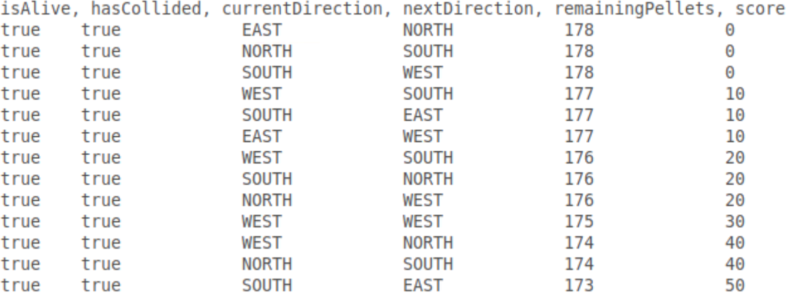

# Security Testing

In May of 2018, a [Code Injection Vulnerability was discovered in the Desktop Signal app](https://thehackernews.com/2018/05/signal-desktop-hacking.html). An attacker could execute code on a victim's machine by sending a specially crafted message. The victim's app would hand over the `/etc/passwd` file, and even send all the chats in plain text, _without any human intervention_! This was ironic since Signal is known for its end-to-end encryption feature.

*Why did this vulnerability exist, and how we could have avoided it? In this chapter, we answer these questions and introduce the concept of security testing.*

After reading this chapter, you should be able to:
- Explain the key difference between traditional software testing and security testing,
- Understand the cause of security vulnerabilities in Java applications,
- Implement the Secure Software Development Life Cycle,
- Explain the various facets of Security Testing,
- Evaluate the key differences between SAST and DAST.

## Software vs. security testing

We start this chapter with what you already know: *software testing*. The key difference between *software testing* and *security testing* is as follows:

> The goal of software testing is to check the correctness of the implemented functionality, while the goal of security testing is to find bugs (i.e. vulnerabilities) that can potentially allow an *intruder* to make the software behave insecurely.

Security testing is all about finding those edge cases in which a software *can be made to* malfunction. What makes a security vulnerability different from a typical software bug is the assumption that *an intruder may exploit it to cause harm*. Often, a software bug is exploited to be used as a security vulnerability, e.g. entering a specially crafted input that triggers a buffer overflow may be used to extract sensitive information from a system's memory. This was done in the [Heartbleed vulnerability](https://heartbleed.com/) that made $$2/3^{rd}$$ of all web servers in the world leak passwords. However, security vulnerabilities are not necessarily software bugs, and are also not always functional, e.g. authentication cookies never being invalidated allows a [Cross Site Request Forgery](https://owasp.org/www-community/attacks/csrf) attack, in which an attacker exploits a valid cookie to forge a victim's action.  

 Similar to traditional testing, thoroughly testing software *does not* guarantee the absence of security vulnerabilities. In fact, new *variants of exploits* can pop up at any time and can hit even a time-tested software. This is why security testing is not a one-off event, but has to be incorporated in the whole Software Development Lifecycle.


We discuss the **Secure Software Development Life Cycle** later in this chapter.


Security testers are always at an arms-race with the attackers. Their aim is to find and fix the vulnerabilities before the adversary gets the chance to exploit them.
You can think of the attack surface as the surface of a rubber balloon, as shown in the figure: there are endless points on this surface that, when pricked by a needle (exploit analogy) will pop the balloon. The goal of security testing is to limit the exposed attack surface and to increase the efforts required by the attackers to exploit it.


## Understanding Java vulnerabilities

In this chapter, we investigate the threat landscape of Java applications because of its popularity: 3 billion devices run Java globally [according to Oracle](https://www.oracle.com/java/). Also, Java is often considered to be a more mature language: Java handles memory management and garbage collection itself, unlike C that requires developers to handle these tasks manually. However, the added abstraction layers might make Java code slower than native C code; this is why some Java components are built upon native code for optimization purposes.

> The Java Virtual Machine, the sandbox that enables Java programs to execute platform-independently, is itself written in C.

In order to understand the threat landscape for Java applications, we must analyse what kind of security vulnerabilities have been discovered in them over the years. There exist online repositories that consolidate such vulnerability information. The [NIST National Vulnerability Database](https://www.cvedetails.com/) is one such example.

The [National Vulnerability Database](https://www.cvedetails.com/) is the largest repository of security vulnerabilities that are discovered in open source software. Each vulnerability is assigned a unique ***CVE (Common Vulnerabilities and Exposures)*** identifier, a ***CWE (Common Weakness Enumeration)*** that determines the _type_ of vulnerability, and a ***CVSS (Common Vulnerability Scoring System)*** score that determines the _severity_ of the vulnerability. Additionally, you can also view the products and their versions that are affected by the vulnerability.


### JRE vulnerabilities


The plots show the number of vulnerabilities (left) and type of vulnerabilities (right) in the Java Runtime Environment (JRE) from 2007 to 2019. The spike in 2013 and 2014 is due to the exploitation of the *Type Confusion Vulnerability (explained later)*, that allows a user to bypass the Java Security Manager and perform high privileged actions.

### Android vulnerabilities


The second set of plots show vulnerabilities discovered between 2009 and 2019 in Android OS, which is mostly written in Java.

What is interesting to see in these plots is that the top 3 vulnerability types are related to *bypassing controls*, *executing code in unauthorized places*, and causing *denial of service*. Hence, we see that although memory corruption is not a major threat for Java applications, the effects caused by classical buffer overflows in C applications can still be achieved in Java by other means.

## Vulnerability use cases

Let's take the following commonly exploited vulnerabilities in Java applications, and analyse how they work:
1. Code injection vulnerability
  * Update attack
2. Type confusion vulnerability
  * Bypassing Java Security Manager
3. Buffer overflow vulnerability
4. Arbitrary Code Execution (ACE)
5. Remote Code execution (RCE)

### Code injection vulnerability

The code snippet below has a *Code Injection* vulnerability.  

``` java

Socket socket = null;
BufferedReader readerBuffered = null;
InputStreamReader readerInputStream = null;

/*Read data using an outbound tcp connection */
socket = new Socket("host.example.org", 39544);

/* Read input from socket */
readerInputStream = new InputStreamReader(socket.getInputStream(), "UTF-8");
readerBuffered = new BufferedReader(readerInputStream);

/* Read data using an outbound tcp connection */
String data = readerBuffered.readLine();

Class<?> tempClass = Class.forName(data);
Object tempClassObject = tempClass.newInstance();

IO.writeLine(tempClassObject.toString());

// Use tempClass in some way

```

The `Class.forName(data)` is the root cause of the vulnerability. If you look closely, the object's value is loaded dynamically from `host.example.org:39544`. If the host is controlled by an attacker, they can introduce new functions or overload existing ones with their malicious code in the class that is returned. This new code becomes part of the application's logic at run-time.
A famous version of this attack is an **Update attack** in Android applications, where a plugin seems benign, but it downloads malicious code at run-time.

Static analysis tools often fail to detect this attack, since the malicious code is not yet part of the application logic at the checking time.
>Due to the variations that Code Injection can present itself in, it is the top entry in the [OWASP Top 10 list of vulnerabilities](https://owasp.org/www-project-top-ten/). To limit its effect, developers can disallow 'untrusted' plugins, and can limit the privileges that a certain plugin has, e.g. by disallowing plugins to access sensitive folders.


### Type confusion vulnerability

This vulnerability was present in the implementation of the `tryfinally()` method in the *Reflection API* of the [Hibernate ORM library](https://access.redhat.com/security/cve/cve-2014-3558). Due to insufficient type checks in this method, an attacker could cast objects into arbitrary types with varying privileges.

The Type confusion vulnerability is explained in [this blog by Vincent Lee](https://www.thezdi.com/blog/2018/4/25/when-java-throws-you-a-lemon-make-limenade-sandbox-escape-by-type-confusion), from where we take the example below.

``` java
class Cast1 extends Throwable {
  Object lemon;
}

class Cast2 extends Throwable {
  Lime lime;
}

public static void throwEx() throws Throwable {
  throw new Cast1();
}

public static void handleEx(Cast2 e) {
  e.lime.makeLimenade();
}
```

Suppose that an attacker wants to execute the `makeLimenade()` method of the `Lime` object, but only has access to a `lemon` of type `Object`. The attacker exploits the fact that `throwEx()` throws a `Cast1` (lemon) object, while `handleEx()` accepts a `Cast2` (lime) object.

For the sake of brevity, consider that the output of `throwEx()` is an input to `handleEx()`. In the old and vulnerable version of Java, these type mismatches did not raise any alerts, so an attacker could send a `lemon` object that was then cast into a `Lime` type object, hence allowing them to call the `makeLimenade()` function from *(what was originally)* a `lemon`.

In a real setting, an attacker can use this _type confusion_ vulnerability to escalate their privileges by **bypassing the Java Security Manager (JSM)**. The attacker's goal is to access `System.security` object and set it to `null`, which will disable the JSM. However, the `security` field is private and cannot be accessed by an object that the attacker has (let's call it `Obj`). So, they will exploit the _type confusion_ vulnerability to cast `Obj` into something that does have higher privileges and access to the `System.security` field. Once the JSM is bypassed, the attacker can execute whatever code they want to.


### Arbitrary Code Execution (ACE)

A common misconception is that Java, unlike C, is not vulnerable to **Buffer overflows**. In fact, any component implemented in native code is as much vulnerable to exploits as the original C code would be. An interesting example here is of graphics libraries that often use native code for fast rendering.

An earlier version of a GIF library in the Sun JVM contained a memory corruption vulnerability: A valid GIF component with the block's width set to 0 caused a _buffer overflow_ when the parser copied data to the under-allocated memory chunk. This overflow caused multiple pointers to be corrupted, and resulted in **Arbitrary Code Execution** (see [CVE-2007-0243](https://cve.mitre.org/cgi-bin/cvename.cgi?name=CVE-2007-0243) for more details).

A similar effect was caused by an [XML deserialization bug in the XStream library](https://access.redhat.com/security/cve/cve-2013-7285): while deserializing XML into a Java Object, a malicious XML input caused the memory pointer to start executing code from _arbitrary memory locations_ (which could potentially be controlled by an attacker).

When an ACE is triggered remotely, it is called a **Remote Code Execution** (RCE) vulnerability. The underlying principle is the same: it is also caused by *Improper handling of 'special code elements'*. We have seen it in the [Spring Data Commons](https://pivotal.io/security/cve-2018-1273) library, a part of the Spring framework that provides cloud resources for database connections.

An Oracle report in 2018 stated that [most of the Java vulnerabilities can be remotely exploited](https://www.waratek.com/alert-oracle-guidance-cpu-april-2018/). With 3 billion devices running Java, this creates a large attack surface.


## The Secure Software Development Life Cycle (Secure-SDLC)

Security testing is a type of non-functional testing, but if it fails to fix security vulnerabilities, (i) there is a high impact on the functionality of the application, e.g. a denial of service attack that makes the entire application unreachable, and (ii) it also causes reputation and/or monetary loss, e.g. loss of customers.

There is an interesting debate about *who gets the responsibility for security testing*.
The pragmatic approach is to **include security testing in each phase of the SDLC**.

The figure below shows the Secure-SDLC variant of the traditional SDLC taken from [this article by Rohit Singh](https://www.dignitasdigital.com/blog/easy-way-to-understand-sdlc/).


At the *planning phase*, risk assessment should be done and potential abuse cases should be designed that the application will be protected against. In the *analysis phase*, the threat landscape should be explored, and attacker modelling should be done.

>For example, an attacker model is that the vendor that supplies the plugins has been infected, so all plugins received from the vendor might be malicious.

The *design* and *implementation* plans of the application should include insights from the attacker model and abuse cases.

>For example, the choice of certain libraries, and the permissions assigned to certain modules should be guided by the threat landscape under consideration.

Security testing should be a part of the *testing and integration* phases. Code reviews should also be done from the perspective of the attacker (using abuse cases). Finally, during the *maintenance phase*, in addition to bug fixes, developers should keep an eye on the CVE database and update *(if possible)* the vulnerable components in the application.

*Just like the traditional SDLC is not a one-time process, the Secure-SDLC is also a continuous process*. Therefore, security testing should also be integrated into the *Continuous Integration* framework as well.

Currently, most companies solely do *penetration testing* which tests the entire application at the very end of the SDLC. The problem with penetration testing is that it tests the application as a whole, and does not stress-test each individual component. When security is not an integral part of the design phase, the vulnerabilities discovered in the penetration testing phase are patched in an ad-hoc manner that increase the risk of them falling apart after deployment.


## Facets of security testing

As such, the term *security testing* is very broad and it covers a number of overlapping concepts. We classify them as follows:

|         |    White-box    |    Black-box    |
|------------|----------------------------------------------------|-------------------------------------------------------------------------|
|    **Static Application Security Testing**    | Code checking, Pattern matching, ASTs, CFGs,  DFDs  |  |
|    **Dynamic Application Security Testing**    | Tainting, Dynamic validation, Symbolic  execution | Penetration testing,  Reverse engineering, Behavioural analysis,  Fuzzing |

You should already be familiar with _white/black-box_ testing, static testing and some of the mentioned techniques.


 In this chapter, we specifically focus on how to use these techniques to find security vulnerabilities. 


In the context of automated security testing, _static_ and _dynamic_ analysis are called _Static Application Security Testing (SAST)_ and _Dynamic Application Security Testing (DAST)_, respectively.
Before we dive into further explanation of SAST and DAST techniques, let's look at the assessment criteria evaluating the quality of security testing techniques.

### Quality assessment criteria
The quality of testing tools is evaluated in a number of ways. You have already learnt about _code coverage_ in a previous chapter. Here, we discuss four new metrics that are often used in the context of security testing:
Designing an ideal testing tool requires striking a balance between two measures: (a) Soundness, and (b) Completeness.

**Soundness** dictates that there should be no False Negatives (FN) — no vulnerability should be skipped. This implies that no alarm is raised *IFF* there is no existing vulnerability in the *System Under Test (SUT)*. **Completeness** dictates that there should be no False Positives (FP) — no false alarm should be raised. This implies that an alarm is raised *IFF* a valid vulnerability is found.

A perfect testing tool is both sound and complete. However, this is an undecidable problem — given finite time, the tool will always be wrong for some input. In reality, tools often compromise of FPs or FNs.

Low FNs are ideal for security critical applications where a missed vulnerability can cause significant loss, e.g. banking apps. Low FPs are ideal for applications that don't have a lot of manpower to evaluate the correctness of each result.

Additionally, an ideal testing tool is **interpretable**: an analyst can trace the results to a solid cause, and are **scalable**: the tool can be used for large applications without compromising heavily on performance.


## Static Application Security Testing (SAST)


SAST techniques aim to find security bugs without running the application. They can find bugs that can be observed in the source code and for which _signatures_ can be made, e.g. SQL Injection and basic Cross-Site Scripting. _SpotBugs_, _FindSecBugs_, and _Coverity_ are static analysis tools specially meant to test security problems in applications.

SAST is not only limited to code checking — it includes any approach that does not require running the SUT. For example, **Risk-based testing**  is a business-level process where we model the worst-case scenarios (or abuse cases) using threat modelling. An application is tested against the generated abuse cases to check its resilience against them. *Risk-based testing can be done both statically and dynamically.*

Below, we discuss SAST techniques and provide examples of the security bugs that they can find.

1. Code checking for security
  * Pattern matching via _RegEx_
  * Syntax analysis via _Abstract Syntax Trees_
3. Structural testing for security
  * Control Flow Graphs (CFGs)
  * Data Flow Diagrams (DFDs)

### Code checking for security

#### Pattern matching via RegEx
Pattern matching can find simplistic security issues, such as:
1. *Misconfigurations*, like `port 22` being open for every user,
2. *Potentially bad imports*, like importing the whole `System.IO` namespace,
3. *Calls to dangerous functions*, like `strcpy` and `memcpy`.

#### Syntax analysis via AST

Abstract Syntax Trees can also find security misconfigurations in the codebase, and sometimes are more appropriate than using regular expressions. Code that violates security specifications can be detected by walking the AST. For example, for a rule specifying how the print function should be used, i.e. `printf(format_string, args_to_print)`, and the following code snippet, an error will be raised because of a missing parameter that can be detected by counting the child-nodes.


This is an example of the famous *[Format string attack](https://owasp.org/www-community/attacks/Format_string_attack)*, which exploits a vulnerability in the `printf()` function family: in the absence of a format string parameter like `%s`, an attacker can supply their own format string parameter in the input, which will be evaluated as a pointer resulting in either arbitrary code execution or the denial of service.


### Structural testing for security

#### Control Flow Graphs (CFGs)
Recall that **Control Flow Graphs** show how the control is transferred among different pieces of code in an application. A CFG is an *over-estimation* of what any potential execution might look like — it is the union of all possible combinations of execution paths.

For security testers, a CFG is an overall picture of an application's behaviour, in a graphical format. It can help testers pin-point strange control transfers, e.g.
* *an unintended transition going from a low- to a high- privileged code block*, or
* *certain unreachable pieces of code* that can result in application hanging and eventually, a denial of service.

Existing literature has used CFGs to detect the maliciousness of an application based on how its CFG looks like. For example, [this work by Bruschi _et al._](https://link.springer.com/chapter/10.1007/11790754_8) detects self-mutating malware by comparing its CFG with CFGs of known malwares, and [this work by Sun _et al._](https://link.springer.com/chapter/10.1007/978-3-642-55415-5_12) uses CFGs to measure code reuse as a means to detect malware variants.

#### Data Flow Diagram (DFD)

A DFD is built on top of a CFG and shows how data traverses through a program. Since Data Flow Analysis (DFA) is also a static approach, a DFD tracks all possible values a variable might have during any execution of the program. This can be used to detect _sanitization problems_, such as the deserialization vulnerability that caused an ACE, and some simplistic _code injection vulnerabilities_.

**How DFA works:** A user-controlled variable whose value we intend to track is called a ***Source***, and the other variables are called ***Sinks***. We say that the *Source variables are tainted* and *all Sinks are untainted*. For a Source to be connected to a Sink, it must first be untainted by proper input validation, for example.

In DFA, we prove that (a) _No tainted data is used_, and (b) _No untainted data is expected_. An alert is raised if either of the two conditions are violated. Consider the following scenario for a single Source and Sink. There exists a direct path between a Source and a Sink, which violates the first rule. This indicates that a malicious user input can cause an SQL injection attack. The solution to fix this violation is to include an input clean-up step between the Source and Sink variables.


The code snippet below shows a real case that DFA can detect. The variable `data` is tainted, as it is received from a user. Without any input cleaning, it is directly used in `println()` method that expects untainted data, thus raising an alert.


``` Java
/* Uses bad source and bad sink */
public void bad(HttpServletRequest request, HttpServletResponse response)
  throws Throwable {

  String data;

  /* Potential flaw: Read data from a queryString using getParameter */
  data  = request.getParameter("name");

  if (data != null) {
    /* Potential flaw: Display of data in web pages after using
    * replaceAll() to remove script tags,
    * will still allow XSS with string like <scr<script>ipt>. */
    response.getWriter().println("<br>bad(): data = " +
    	data.replaceAll("(<script>)", ""));
  }
}

```


 A dynamic version of Data Flow Analysis is called Taint analysis, where the tainted variables' values are tracked in memory. We cover it in the DAST section of this chapter. 


##### Reaching Definitions Analysis
 One application of DFA is called the **Reaching Definitions**. It is a top-down approach that identifies all the possible values of a variable. For security purposes, it can detect the _Type Confusion vulnerability_ and _Use-after-free vulnerability_ (which uses a variable after its memory has been freed).

 Consider the following code snippet and its CFG given below:


``` java
int b = 0;
int c = 1;

for (int a = 0; a < 3; a++) {
  if (a > 1)
    b = 10;
  else
    c = b;
}
return b, c;
```


The solid transitions show *control transfers*, while the dotted transitions show *data transfers*. Suppose that we want to perform reaching definitions analysis of the three variables: `a`, `b`, and `c`. First, we label each basic block, and draw a table that lists the variable values in each block.


If a variable is not used in the block, or the value remains the same, nothing is listed. At the end, each column of the table is merged to list the full set of potential values for each variable.


| code blocks | **a** | **b** | **c** |
|:----:|:--------:|:----:|:---:|
| **b1** | - | 0 | 1 |
| **b2** | 0, **a**++ | - | - |
| **b3** | - | - | - |
| **b4** | - | 10 | - |
| **b5** | - | - | **b** |
| **b6** | - | - | - |

Remember, if the value of a variable is controlled by a user-controlled parameter, it cannot be resolved until run-time, so it is written as it is.
If a variable `X` copies its value to another variable `Y`, then the reaching definitions analysis dictates that the variable `Y` will receive all potential values of `X`, once they become known.
Also, whether a loop terminates is an undecidable problem (also called the *halting problem*), so finding the actual values that a looping variable takes on is not possible using static analysis.

The analysis results in the following values of the three variables. If you look closely, some values are impossible during actual run-time, but since we trace the data flow statically, we perform an over-estimation of the allowed values. This is why, static analysis, in particular DFA, is `Sound` but `Incomplete`.

``` java
a = {0, 1, 2, 3, ...}
b = {0, 10}                // 0 is impossible       
c = {1, b} -> {0, 1, 10}  // 1, 10 are impossible
```

## Dynamic Application Security Testing (DAST)

Application crashes and hangs leading to Denial of Service attacks are common security problems. They cannot be detected by static analysis since they are only triggered when the application is executed.
DAST techniques execute an application and observe its behaviour. Since DAST tools typically do not have access to the source code, they can only test for functional code paths, and the analysis is only as good as the behaviour triggering mechanism. This is why, search-based algorithms have been proposed to maximize the code coverage, e.g. see [this work by Gross _et al._](https://dl.acm.org/doi/abs/10.1145/2338965.2336762) and [this work by Chen _et al._](https://ieeexplore.ieee.org/abstract/document/8418633).

DAST tools are typically difficult to set-up, because they need to be hooked-up with the SUT, sometimes even requiring to modify the SUT's codebase, e.g. for instrumentation. They are also slower because of the added abstraction layer that monitors the application's behaviour. Nevertheless, they typically produce less false positives and more advanced results compared to SAST tools. Even when attackers obfuscate the codebase to the extent that it is not statically analysable anymore, dynamic testing can still monitor the behaviour and report strange activities. _BurpSuite_, _SonarQube_, and _OWASP's ZAP_ are some dynamic security testing tools.

In this section, we explain the following techniques for dynamic analysis:

1. Taint analysis
2. Dynamic validation
3. Penetration testing
4. Behavioural analysis
5. Reverse Engineering
6. Fuzzing

### Taint analysis

Taint analysis is the dynamic version of Data Flow Analysis. In taint analysis, we track the values of variables that we want to *taint*, by maintaining a so-called *taint table*. For each tainted variable, we analyse how the value propagates throughout the codebase and affects other statements and variables. To enable tainting, ***code instrumentation*** is done by adding hooks to variables that are of interest. _Pin_ is an instrumentation tool from Intel, which allows taint analysis of binaries.

An example here is of the tool [Panorama](https://dl.acm.org/doi/abs/10.1145/1315245.1315261) that detects malicious software like _keyloggers_ (that log keystrokes in order to steal credentials) and _spyware_ (that stealthily collects and sends user data to $$3^{rd}$$ parties) using dynamic taint analysis. Panorama works on the intuition that benign software does not interfere with OS-specific information transfer, while information-stealing malware attempts to access the sensitive information being transferred. Similarly, malicious plugins collect and share user information with $$3^{rd}$$ parties while benign plugins don't send information out. These behaviours can be detected using the source/sink principles of taint analysis.  

### Dynamic validation

Dynamic validation does a functional testing of the SUT based on the system specifications. It basically checks for any deviations from the pre-defined specifications. **Model Checking** is a similar idea in which specifications are cross-checked with a model that is learnt from the SUT. Model checking is a broad field in the Software Verification domain.

[This work by Chen _et al._](http://seclab.cs.ucdavis.edu/papers/Hao-Chen-papers/ndss04.pdf) codifies security vulnerabilities as _safety properties_ that can be analysed using model checking. For example, they analyse processes that may contain _race conditions_ that an attacker may exploit to gain control over a system. In this regard, consider the following code snippet. Suppose that the process first checks the owner of `foo.txt`, and then reads `foo.txt`. An attacker may be able to introduce a race condition in between the two statements and alter the symbolic link of `foo.txt` such that it starts referring to `/etc/passwd` file. Hence, what the user reads as `foo.txt` is actually the `/etc/passwd` file that the attacker now has access to.


```java
Files.getOwner("foo.txt");
Files.readAllLines("foo.txt");
```

To check the existence of such scenarios, they codify it in a property that _stops a program from passing the same filename to two system calls on the same path_. Once codified in a model checker, they run it on various applications and report on deviations from this property.   

### Penetration testing

Penetration (or Pen) testing is the most commonly used type of security testing in organizations. It is sometimes also referred as ***Ethical hacking***. What makes pen testing different from others is that it is done from the perspective of an attacker — [pen-testers attempt to breach the security of the SUT just as an adversary might](https://www.ncsc.gov.uk/guidance/penetration-testing). Since it is done from the perspective of the attacker, it is generally black-box, but depending on the assumed knowledge of the attacker, it may also be white-box.

Penetration testing checks the SUT in an end-to-end fashion, which means that it is done once the application is fully implemented, so it can only be done at the end of the SDLC. *MetaSploit* is an example of a powerful penetration testing framework. Most pen testing tools contain a ***Vulnerability Scanner*** module that either *runs existing exploits*, or allow the tester to *create an exploit*. They also contain ***Password Crackers*** that either *brute-force* passwords (i.e. tries all possible combinations given some valid character set), or perform a *dictionary attack* (i.e. chooses inputs from pre-existing password lists).

### Behavioural analysis

Given a software that may contain modules from unknown sources, behavioural analysis aims to gain insights about the software by generating behavioural logs and analysing them. This can be particularly helpful for finding abnormal behaviours (security problems, in particular) when neither the source code, nor the binary are accessible. The logs can be compared with known-normal behaviour in order to debug the SUT.

An example here is of JPacman that currently has support for two point calculator modules (`Scorer 1` and `Scorer 2`) that calculate the score in different ways. The goal is to find what the malicious module (`Scorer 2`) does. We have implemented a ***Naïve Fuzzer*** that automatically runs various instances of JPacman to generate behavioural logs. At each iteration, it randomly picks a move (from the list of acceptable moves) until Pacman dies, and logs the values of different interesting variables. The fuzzing code is given below.

```java
  /**
   * Basic fuzzer implementation.
   *
   * @param repetitionInfo repeated test information
   * @throws IOException when the log write created.
   */
  @RepeatedTest(RUNS)
  void fuzzerTest(RepetitionInfo repetitionInfo) throws IOException {
      Game game = launcher.getGame();
      Direction chosen = Direction.EAST;

      String logFileName = "log_" + repetitionInfo.getCurrentRepetition() + ".txt";
      File logFile = new File(logDirectory, logFileName);

      try (BufferedWriter logWriter = new BufferedWriter(new OutputStreamWriter(
          new FileOutputStream(logFile, true), StandardCharsets.UTF_8))) {

          logWriter.write(LOG_HEADER);

          try {
              game.start();

              while (game.isInProgress()) {
                  chosen = getRandomDirection();

                  log(logWriter, chosen);
                  game.getLevel().move(game.getPlayers().get(0), chosen);
              }
          } catch (RuntimeException e) {
              // Runtime exceptions should not stop the execution of the fuzzer
          } finally {
              log(logWriter, chosen);
              game.stop();
          }
      }
  }

```

Below you see an example of a log file resulting from one run of the fuzzer.




In the figure below, the plots on the right show how the value of `score` variable changes overtime. It is apparent that something goes wrong with `Scorer 2`, since the score is typically programmed to increase monotonically.


Behavioural logs are a good data source for forensic analysis of the SUT.

### Reverse Engineering (RE)

Reverse Engineering is a related concept where the goal is to reveal the internal structure of an application. We can consider RE as a system-wide process that converts a black-box application into a white-box. RE is, strictly speaking, not a testing technique, but it is useful when (i) converting legacy software into a modern one, or (ii) understanding competitor's product.

A use case for the behavioural logs from previous technique is to use them for automated reverse engineering that learns a model of the SUT. This model can then be used for, e.g. *Dynamic validation*, and/or to *guide path exploration* for better code coverage.

For example, [TABOR](https://dl.acm.org/doi/abs/10.1145/3196494.3196546) learns a model of a water treatment plant in order to detect attacks. They learn an automata representing the _normal behaviour_ of the various sensors present in the plant. Anomalous incoming events that deviate from the normal models raise an alert.

### Fuzzing

Fuzzing has been used to uncover previously-unknown security bugs in several applications. _American Fuzzy Lop (AFL)_ is an efficient security fuzzer that has been used to find security vulnerabilities in command-line-oriented tools, like PuTTY, openSSH, and SQLite. [This video](https://www.youtube.com/watch?v=ibjkz7GTT3I) shows how to fuzz _ImageMagick_ using AFL to find security bugs.

Additionally, in 2015 a severe security vulnerability, by the name of [Stagefright](https://blog.zimperium.com/experts-found-a-unicorn-in-the-heart-of-android/), was discovered in Android smartphones that impacted 1 billion devices. It was present in the library for unpacking MMS messages, called `libstagefright`. A specially crafted MMS message could silently cause an overflow leading to remote code execution and privilege escalation. It was discovered by [fuzzing the `libstagefright` library using AFL](https://www.blackhat.com/docs/us-15/materials/us-15-Drake-Stagefright-Scary-Code-In-The-Heart-Of-Android.pdf) that ran \~3200 tests per second for about 3 weeks!

Finally, [Sage](https://dl.acm.org/doi/pdf/10.1145/2090147.2094081) is a white-box fuzzing tool that combines symbolic execution with fuzzing to find deeper security bugs. They report a use case of a critical security bug that black-box fuzzing was unable to find, while Sage discovered it in under 10 hours, despite having no prior knowledge of the file format.

## Performance evaluation of SAST and DAST

* Static analysis tools create a lot of FPs because they cannot see the run-time behaviour of the code. They also generate FNs if they don't have access to some code, e.g. code that is added at run-time.
* Dynamic analysis reduces both FPs and FNs — if an action is suspicious, an alarm will be raised. However, even in this case, we cannot ensure perfect testing.  
* Static analysis is generally more white-box than dynamic analysis, although there are interpretable dynamic testing methods, like symbolic execution.
* Static testing is more scalable in the sense that it is faster, while black-box dynamic testing is more generalizable.

## Chapter Summary

- Software testing checks correctness of the software, while security testing finds potential defects that may be exploited by an intruder.
- Even though Java handles memory management itself, Java applications still have a large attack surface.
- Security testing is much more than penetration testing, and must be integrated at each step of the SDLC.
- Threat modelling can derive effective test cases.
- Perfect (security) testing is impossible.
- SAST checks the code for problems without running it, while DAST runs the code and monitors its behaviour to find problems.
- SAST is fast, but generates many false positives. DAST is operationally expensive, but generates insightful and high-quality results.
- Pattern matching finds limited but easy to find security problems.
- ASTs make the code structure analysis easy. CFGs and DFDs are better at finding security vulnerabilities.
- Behavioural logs are very useful for forensic analysis of the SUT.
- Combining fuzzing with Symbolic execution leads to finding optimal test cases that can maximize code coverage and find maximum security problems.

## Exercises

**Exercise 1.** Why is security testing hard?
1. To find a vulnerability, you must fully understand assembly code.
2. Pointers are hard to follow since they can point to any memory location.
3. Hacking is difficult and requires many years of specialization.
4. There exist a lot of strange inputs, and only few trigger a vulnerability.

**Exercise 2.** Give an example of a software bug that also qualifies as a security vulnerability, and also explain how.

**Exercise 3.** Static analysis can detect some classes of injection vulnerabilities more reliably than others. Which vulnerability is static analysis most likely to _prevent_?
1. Cross-Site Scripting
2. Cross-Site Request Forgery
3. Update attack
4. Format string injection

**Exercise 4.** What is the underlying defect that enables arbitrary code execution?
1. Buffer overflows
2. Deserialising bugs
3. Type confusion
4. All of the above

**Exercise 5.** In the following table, several testing objectives and techniques are given. Associate each _Objective_ with the most appropriate _Testing technique_. Note that no repetitions are allowed.

| Objective | Testing Technique | (Answer option) Testing Technique |
|----------------------------------------|------------------------|-----------------------------------|
| 3. Detect pre-defined patterns in code | A. Fuzzing | __ |
| 2. Branch reachability analysis | B. Regular expressions | __ |
| 1. Testing like an attacker  | C. Symbolic execution | __ |
| 4. Generate complex test cases | D. Penetration testing | __ |

**Exercise 6.** How can you use Tainting to detect spyware?

**Exercise 7.** Perform Reaching Definitions Analysis on the following piece of code. Which values of the variables does the analysis produce?
``` java
        int x = 0;
        int y = 1;
        while(y < 5) {
    	    y++;
        	if(y > 7)
        		x = 12;
        	else
        		x = 21;
    	}
        return x;
```
1. $$x = \{0\}; y = \{0,1,2,3,...\}$$
2. $$x = \{0,21\}; y = \{1,2,3,...\}$$
3. $$x = \{0,12,21\}; y = \{1,2,3,...\}$$
4. $$x = \{21\}; y = \{1,2,3,4\}$$

## References
* Bruschi, Danilo, Lorenzo Martignoni, and Mattia Monga. "Detecting self-mutating malware using control-flow graph matching." In International conference on detection of intrusions and malware, and vulnerability assessment, pp. 129-143. Springer, Berlin, Heidelberg, 2006.
* Chen, Hao, Drew Dean, and David A. Wagner. "Model Checking One Million Lines of C Code." In NDSS, vol. 4, pp. 171-185. 2004.
* Chen, Peng, and Hao Chen. "Angora: Efficient fuzzing by principled search." In 2018 IEEE Symposium on Security and Privacy (SP), pp. 711-725. IEEE, 2018.
* Godefroid, Patrice, Michael Y. Levin, and David Molnar. "SAGE: whitebox fuzzing for security testing." Queue 10, no. 1 (2012): 20-27.
* Gross, Florian, Gordon Fraser, and Andreas Zeller. "Search-based system testing: high coverage, no false alarms." In Proceedings of the 2012 International Symposium on Software Testing and Analysis, pp. 67-77. 2012.
* Lin, Qin, Sridha Adepu, Sicco Verwer, and Aditya Mathur. "TABOR: A graphical model-based approach for anomaly detection in industrial control systems." In Proceedings of the 2018 on Asia Conference on Computer and Communications Security, pp. 525-536. 2018.
* Sun, Xin, Yibing Zhongyang, Zhi Xin, Bing Mao, and Li Xie. "Detecting code reuse in android applications using component-based control flow graph." In IFIP international information security conference, pp. 142-155. Springer, Berlin, Heidelberg, 2014.
* Yin, Heng, Dawn Song, Manuel Egele, Christopher Kruegel, and Engin Kirda. "Panorama: capturing system-wide information flow for malware detection and analysis." In Proceedings of the 14th ACM conference on Computer and communications security, pp. 116-127. 2007.
