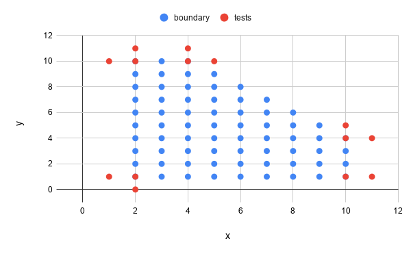

# Domain testing examples

This chapter follows a problem-based approach. We first show a program requirement, and then, show how we would apply equivalent class analysis and boundary testing.

We will follow a common strategy when applying domain testing, highly influenced by how Kaner et al. do:

1. We read the requirement
2. We identify the input and output variables in play, together with their types, and their ranges.
3. We identify the dependencies (or independence) among input variables, and how input variables influence the output variable.
4. We perform equivalent class analysis (valid and invalid classes).
5. We explore the boundaries of these classes.
6. We think of a strategy to derive test cases, focusing on minimizing the costs while maximizing fault detection capability.
7. We generate a set of test cases that should be executed against the system under test.

See the videos for detailed explanations. See also the JUnit test cases we implemented for them in https://github.com/sttp-book/code-examples/tree/master/src/test/java/tudelft/domain.




## Exercise 1: The Sum Of Integers

A program receives two numbers and returns the sum of these two integers. Numbers are between 1 *inclusive* and 99 *inclusive*.

| Variables         | Types     | Ranges    |
| ---               | ---       | ---       |
| X - First number  | Integer   | [1, 99]   |
| Y - Second number | Integer   | [1, 99]   |
| Sum - Output      | Integer   | [1, inf]  |

### Dependency among variables:

* X and Y are independent (X doesn't influence the range of Y, and vice-versa).
* X and Y are used to calculate Sum.

### Equivalence partitioning / Boundary analysis

| Variable  | Equivalence classes   | Invalid classes   | Boundaries    |
| ---       | ---                   | ---               | :---:         |
| X         | [1, 99]               | < 1               | *valid* 1 &#124; 0 *invalid*    |
|           |                       | > 99              | 99 &#124; 100 |
| Y         | [1, 99]               | < 1               | 1 &#124; 0    |
|           |                       | > 99              | 99 &#124; 100 |

### Strategy

* Variables are independent (X does not affect the range of Y, and vice-versa).
* 7 tests for X (3 partitions + 4 boundaries), in point for Y.
* 7 tests for Y (3 partitions + 4 boundaries), in points for X.
* Total of 14 tests

*In-point X = 50, In-point Y = 50.*

| Test cases    | X     | Y     | Sum       | Remark    |
| ---           | ---   | ---   | ---       | ---       |
| T1            | 50    | 50    | 100       | x &isinv; [1, 99], &Tab; *y remains fixed for T1-T7*|
| T2            | -100  | 50    | *invalid* | x < 1     |
| T3            | 250   | 50    | *invalid* | x > 99    |
| T4            | 0     | 50    | *invalid* | x = 0     |
| T5            | 1     | 50    | 51        | x = 1     |
| T6            | 99    | 50    | 149       | x = 99    |
| T7            | 100   | 50    | *invalid* | x = 100   |
| T8            | 50    | 50    | 100       | y &isinv; [1, 99], &Tab; *x remains fixed for T8-T14*|
| T9            | 50    | -100  | *invalid* | y < 1     |
| T10           | 50    | 250   | *invalid* | y > 99    |
| T11           | 50    | 0     | *invalid* | y = 0     |
| T12           | 50    | 1     | 51        | y = 1     |
| T13           | 50    | 99    | 149       | y = 99    |
| T14           | 50    | 100   | *invalid* | y = 100   |

**Questions:**

* Do we need T3 and T7? Or are they testing the same thing (i.e. > 99)? (Same applies to T10 and T14.) If we remove one of them, we end up with 12 tests.
* What would change if the requirement had something like sum < 167 ?




## Exercise 2: The Sum Of Integers, part 2

A program receives two numbers and returns the sum of these two integers. Numbers are between 1 *inclusive* and 99 *inclusive*.
Final sum should be <= 165.

| Variables         | Types     | Ranges    |
| ---               | ---       | ---       |
| X - First number  | Integer   | [1, 99]   |
| Y - Second number | Integer   | [1, 99]   |
| Sum - Output      | Integer   | [0, 165]  |

### Dependency among variables:

* X and Y are independent (X doesn't influence the range of Y, and vice-versa).
* X and Y are used to calculate Sum.
* X + Y <= 165

### Equivalence partitioning / Boundary analysis

| Variable  | Equivalence classes   | Invalid classes   | Boundaries    |
| ---       | ---                   | ---               | :---:         |
| X         | [1, 99]               | < 1               | *valid* 1 &#124; 0 *invalid*    |
|           |                       | > 99              | 99 &#124; 100 |
| Y         | [1, 99]               | < 1               | 1 &#124; 0    |
|           |                       | > 99              | 99 &#124; 100 |
| Sum       | [0, 165]              | > 165             | 165 &#124; 166    |

### Strategy

* Variables are independent (X does not affect the range of Y, and vice-versa).
* 7 tests for X (3 partitions + 4 boundaries), in point for Y,
* 7 tests for Y (3 partitions + 4 boundaries), in points for X.
* 2 tests for the boundary on Sum.
* Total of 16 tests

*In-point X = 50 (taking into consideration that X <= 165 - Y),
In-point Y = 50 (taking into consideration that Y <= 165 - X).*

| Test cases    | X     | Y     | Sum       | Remark    |
| ---           | ---   | ---   | ---       | ---       |
| T1            | 50    | 50    | 100       | x &isinv; [1, 99], &Tab; *y remains fixed for T1-T7*|
| T2            | -100  | 50    | *invalid* | x < 1     |
| T3            | 250   | 50    | *invalid* | x > 99    |
| T4            | 0     | 50    | *invalid* | x = 0     |
| T5            | 1     | 50    | 51        | x = 1     |
| T6            | 99    | 50    | 149       | x = 99    |
| T7            | 100   | 50    | *invalid* | x = 100   |
| T8            | 50    | 50    | 100       | y &isinv; [1, 99], &Tab; *x remains fixed for T8-T14*|
| T9            | 50    | -100  | *invalid* | y < 1     |
| T10           | 50    | 250   | *invalid* | y > 99    |
| T11           | 50    | 0     | *invalid* | y = 0     |
| T12           | 50    | 1     | 51        | y = 1     |
| T13           | 50    | 99    | 149       | y = 99    |
| T14           | 50    | 100   | *invalid* | y = 100   |
| T15           | 82    | 83    | 165       |           |
| T16           | 83    | 83    | *invalid* |           |




## Exercise 3: Passing Grade

A student passes an exam if s/he gets a grade >= 5.0. Grades below that are a fail.

Grades range from [1.0, 10.0]. Assume the system doesn't allow for invalid grades (e.g., 0.9, 10.5).

### Variables

| Variables | Types   | Ranges     | Notes                |
|-----------|---------|------------|----------------------|
| grade     | float   | [1, 10]    | (no one gets a 0...) |
| pass      | boolean | true/false | output variable      |

### Dependencies among variables

- No dependencies among input variables (grade is the only one).
- Grade is used to decide the pass/fail.

### Equivalence partitioning / Boundary analysis

| Variable | Equivalence Classes | Invalid Classes | Boundaries |
|----------|---------------------|-----------------|------------|
| grade    | [1,5[               |                 | 1          |
|          |                     |                 | 4.9        |
|          |                     |                 | 5          |
|          | [5, 10]             |                 | 4.9        |
|          |                     |                 | 5          |
|          |                     |                 | 10         |

We do not need to test 0.9 and 10.1 because we assume that the system doesn't allow for them.

### Strategy

Boundaries seem to be enough.

| Test Case | Grade (input) | Pass (output) | Notes          |
|-----------|---------------|---------------|----------------|
| T1        | 1             | false         |                |
| T2        | 4.9           | false         |                |
| T3        | 5             | true          |                |
| T4        | 7.5           | true          | extra in-point |
| T5        | 10            | true          |                |




## Exercise 4: Passing Concepts

The final grade of a student is calculated as follows:

* `1 <= grade < 5` => **`F`**
* `5 <= grade < 6` => **`E`**
* `6 <= grade < 7` => **`D`**
* `7 <= grade < 8` => **`C`**
* `8 <= grade < 9` => **`B`**
* `9 <= grade <= 10` => **`A`**

The system does not allow for invalid grades (e.g. 0.9, 10.5)

### Variables

| Variable | type | range | remark |
| -------- | ---- | ----- | ------- |
| Grade | float | [1, 10] | no one gets a 0 |
| Concept | Enumerate | [F, E, D, B, C, A] | output variable |

### Dependency among variables

*There are no dependencies among the input variables, since we only have one variable.

* The grade is used to decide the concept.

### Equivalence Partitioning/Boundary Analysis

| Variable | Equivalence classes | Invalid classes | Boundaries |
| -------- | ------------------- | --------------- | ---------- |
| Grade | [1,5[ | | |
| | | | 1 |
| | | | 5 |
| | | | 4.9 |
| | [5,6[ | | |
| | | | 4.9 |
| | | | 5 |
| | | | 6 |
| | | | 5.9 |
| | [6,7[ | | |
| | | | 5.9 |
| | | | 6 |
| | | | 7 |
| | | | 6.9 |
| | [7,8[ | | |
| | | | 6.9 |
| | | | 7 |
| | | | 8 |
| | | | 7.9 |
| | [8,9[ | | |
| | | | 7.9 |
| | | | 8 |
| | | | 9 |
| | | | 8.9 |
| | [9,10] | | |
| | | | 8.9 |
| | | | 9 |
| | | | 10 |

### Strategy

Test all boundaries, yielding 12 tests.

| Test case | Grade | Concept (output) |
| --------- | ----- | ---------------- |
| T1 | 1 | F |
| T2 | 4.9 | F |
| T3 | 5 | E |
| T4 | 5.9 | E |
| T5 | 6 | D |
| T6 | 6.9 | D |
| T7 | 7 | C |
| T8 | 7.9 | C |
| T9 | 8 | B |
| T10 | 8.9 | B |
| T11 | 9 | A |
| T12 | 10 | A |




## Exercise 5: The MSc admission problem

A student can only join the MSc if :
* `ACT = 36` and `GPA >= 3.5`
* `ACT >= 35` and `GPA >= 3.6`
* `ACT >= 34` and `GPA >= 3.7`
* `ACT >= 33` and `GPA >= 3.8`
* `ACT >= 32` and `GPA >= 3.9`
* `ACT >= 31` and `GPA = 4.0`
*ACT is an integer between 0 and 36 (inclusive).*
*GPA are float variables between 0.0 and 4.0 (single decimal digit) (inclusive).*

### Variables
| Variables	| Types		| Ranges 	|
| ---		| ---		| ---		|
| ACT		| integer	| [0, 36]	|
| GPA		| float		| [0.0, 4.0]	|
| Decision	| boolean 	| true/false	|

### Dependency among variables
* ACT and GPA have a joint effect
* ACT and GPA are used to calculate Decision.

### Equivalence partitioning / Boundary Analysis

The conditions from the requirements are really close with each other. Because of that, finding values that cross the boundary between partitions is challenging. We also note that the boundary that matters here is from (student being approved) -> (student not being approved). So, for each partition, we should find its boundary that would force the student not being approved.

These boundary points can found through the following process. We first find the on-point of the boundary, for instance (35, 3.6), then discover the closest inputs that would make the student to fail. In this example, (34, 3.6) and (35, 3.5). Note that there exists one special case (= 36, >= 3.5). Since it contains an equality condition, we have two off-points to explore.

Also note that we are using in-points that are on-points too. This is less common, but in the case of this problem choosing anohter in-point might make the final outcome to still not change between the boundary tests we devised.
For example, if we choose a GPA in-point of 3.6, the 35 and 36 ACT will have the same outcome value (as the next rule will intervene).

| Variable	| Equivalence classes	| Boundaries	| Remark	|
| ---		| ---					| ---			| ---		|
|(ACT, GPA)	| (= 36, >= 3.5)		| (35, in)		| in-point GPA = 3.5 	|
|			| 						| (36, in)		| on-point			|
|			| 						| (37, in)		| 			|
|			| 						| (in, 3.5)		| in-point ACT = 36		|
|			| 						| (in, 3.4)		| 			|
|			| (>= 35, >= 3.6)		| (35, in)		| in-point GPA = 3.6 	|
|			| 						| (34, in)		| 			|
|			| 						| (in, 3.6)		| in-point ACT = 35		|
|			| 						| (in, 3.5)		| 			|
|			| (>= 34, >= 3.7)		| (34, in)		| in-point GPA = 3.7 	|
|			| 						| (33, in)		| 			|
|			| 						| (in, 3.7)		| in-point ACT = 34		|
|			| 						| (in, 3.6)		| 			|
|			| (>= 33, >= 3.8)		| (33, in)		| in-point GPA = 3.8 	|
|			| 						| (32, in)		| 			|
|			| 						| (in, 3.8)		| in-point ACT = 33		|
|			| 						| (in, 3.7)		| 			|
|			| (>= 32, >= 3.9)		| (32, in)		| in-point GPA = 3.9 	|
|			| 						| (31, in)		| 			|
|			| 						| (in, 3.9)		| in-point ACT = 32		|
|			| 						| (in, 3.8)		| 			|
|			| (>= 31, = 4.0)		| (31, in)		| in-point GPA = 4.0 	|
|			| 						| (30, in)		| 			|
|			| 						| (in, 4.0)		| in-point ACT = 31		|
|			| 						| (in, 3.9)		| 			|
|			| (< 0, < 0.0)			| (-1, in)		| in-point GPA = 0.1 	|
|			| 						| (in, -0.1)	| in-point ACT = 1		|
|			| (> 36, > 4.0)			| (37, in)		| in-point GPA = 4 		|
|			| 						| (in, 4.1)		| in-point ACT = 36		|

### Strategy
* There are 24 boundaries *(for conditions on valid inputs)*, but some are repeated. 14 boundary tests.
  * (37, 3.5) is an invalid path, so we can ignore. Therefore 13 test cases.

| Test cases	| ACT	| GPA	| Decision	|
| ---			| ---	| ---	| ---		|
| T1 			| 35 	| 3.5	| False		|
| T2 			| 36 	| 3.5	| True		|
| T3 			| 36 	| 3.4	| False		|
| T4 			| 35 	| 3.6	| True		|
| T5 			| 34 	| 3.7	| True		|
| T6 			| 34 	| 3.6	| False		|
| T7 			| 33 	| 3.8	| True		|
| T8 			| 32 	| 3.8	| False		|
| T9 			| 33 	| 3.7	| False		|
| T10 			| 32 	| 3.9	| True		|
| T11			| 31 	| 4.0	| True		|
| T12 			| 30 	| 4.0	| False		|
| T13 			| 31 	| 3.9	| False		|
| T14 			| -1 	| 4.0	| *Invalid*	|
| T15 			| 37 	| 3.5	| *Invalid*	|
| T16 			| 36 	| -0.1	| *Invalid*	|
| T17			| 36	| 4.1	| *Invalid* |




## Exercise 6: The printing label

A printer prints mailing labels.
The first line is the name of the person.

The program builds the name from three fields: first name, middle name, and last name.
Each field can hold up to 30 characters.
The label can be up to 70 characters wide.

### Variables

| Variables     | Types   | Ranges  |
|---------------|---------|---------|
| Len. of FN    | integer | [1, 30] |
| Len. of MN    | integer | [0, 30] |
| Len. of LN    | integer | [0, 30] |
| Output length | integer | [1, 70] |

### Dependencies among variables

FN + MN + LN <= 68

(The difference of 2 (to 70) happens as the system needs to add an empty space in between names)

### Equivalence partitioning / Boundary analysis

| Variable     | Equivalence Classes | Invalid Classes | Boundaries | Notes                           |
|--------------|---------------------|-----------------|------------|---------------------------------|
| FN           | [1, 30]             | invalid string  | 0          | everybody has a first name      |
|              |                     |                 | 1          |                                 |
|              |                     |                 | 30         |                                 |
|              |                     |                 | 31         | same as >30                     |
| MN           | [0, 30]             | invalid string  | 0          | not everybody has a middle name |
|              |                     |                 | -1         |                                 |
|              |                     |                 | 30         |                                 |
|              |                     |                 | 31         |                                 |
| LN           | [0, 30]             | invalid string  | 0          | not everybody has a last name   |
|              |                     |                 | -1         |                                 |
|              |                     |                 | 30         |                                 |
|              |                     |                 | 31         |                                 |
| (FN, MN, LN) | FM + MN + LN <= 68  |                 | 68         |                                 |
|              |                     |                 | 69         |                                 |

### Strategy

* Each variable has 2 partitions, plus a restriction.

* Let's not combine "invalid strings" with them all. So: 3 tests for exceptional cases + 5 * 5 * 5 = 125 + 3 = 128.

* If we focus on the on-points and off-points, and in-points for others, we'd have 4 + 4 + 4 = 12 tests plus invalid cases: 15 tests.

* In-points always taking the FN + MN + LN <= 68 restriction into account.

* Two tests for the extra restriction: 17 tests.

| Test Case | FN             | MN             | LN             | (length) | output  |                          |
|-----------|----------------|----------------|----------------|----------|---------|--------------------------|
| T1        | 0              | 15             | 7              | 22       | invalid | FN boundaries            |
| T2        | 1              | 7              | 2              | 10       | valid   |                          |
| T3        | 30             | 3              | 9              | 42       | valid   |                          |
| T4        | 31             | 21             | 12             | 64       | invalid |                          |
| T5        | 15             | 0              | 15             | 30       | valid   | MN boundaries            |
| T6        | 20             | -1             | 7              | 26       | invalid |                          |
| T7        | 21             | 30             | 6              | 57       | valid   |                          |
| T8        | 22             | 31             | 3              | 56       | invalid |                          |
| T9        | 7              | 3              | 0              | 10       | valid   | LN boundaries            |
| T10       | 2              | 6              | -1             | 7        | invalid |                          |
| T11       | 9              | 18             | 30             | 57       | valid   |                          |
| T12       | 12             | 27             | 31             | 70       | invalid |                          |
| T13       | invalid string | 14             | 20             |          | invalid | invalid classes          |
| T14       | 11             | invalid string | 23             |          | invalid |                          |
| T15       | 9              | 19             | invalid string |          | invalid |                          |
| T16       | 23             | 23             | 22             | 68       | valid   | FN + MN + LN restriction |
| T17       | 23             | 23             | 23             | 69       | invalid |                          |

### Notes:

* We simplified the output by basically returning "valid" or "invalid". You might also wanna check the final name that was generated.
* Test cases with strings of length -1 might then not be possible.




## Exercise 7: Tax Income

Your income is taxed as follows:*

* `0 <= Income < 22100` → **Tax = `0.15 x Income`**
* `22100 <= Income < 53500` → **Tax = `3315 + 0.28 * (Income - 22100)`**
* `53500 <= Income < 115000` → **Tax = `12107 + 0.31 * (Income - 53500)`**
* `115000 <= Income < 250000` → **Tax = `31172 + 0.36 * (Income - 115000)`**
* `250000 <= Income` → **Tax = `79772 + 0.396 * (Income - 250000)`**

### Variables, Types, Ranges

| Variable | Type | Range | Remark |
| -------- | ---- | ----- | ------ |
| Income | double | `[0, infinite]` | input |
| Tax | double | `[0, infinite]` | output |

### Dependency between variables

* Income is used to calculate Tax

### Equivalence partitioning / Boundary analysis

| Variable | Equivalence classes | Invalid classes | Boundaries | Remark |
| -------- | ------------------- | --------------- | ---------- | ------ |
| Income | [0, 22100[ | | -1 | negative number |
|  | | | 0 | |
|  | | | 22099 | 22099.99 is better! |
|  | | | 22100 | |
| | | | | |
| | [22100,53500[ | | 22099 | |
|  | | | 22100 | |
|  | | | 53499 | |
|  | | | 53500 | |
| | | | | |
| | [53500,115000[ | | 53499 | |
|  | | | 53500 | |
|  | | | 114999 | |
|  | | | 115000 | |
| | | | | |
| | [115000,250000[ | | 114999 | |
|  | | | 115000 | |
|  | | | 250000 | |
|  | | | 250001 | |
| | | | | |
| | [250000, infinite[ | | 249999 | |
|  | | | 250000 | |

### Strategy

Test the boundaries (removing duplicates) → 10 tests

### Test cases

|  #  | Income | Tax |
| --- | ------ | --- |
| T1 | -1 | *CANNOT CALC TAX* |
| T2 | 0 | 0 |
| T3 | 22099 | 3314.85 |
| T4 | 22100 | 3315 |
| T5 | 53499 | 12106.72 |
| T6 | 53500 | 12107 |
| T7 | 114999 | 31171.69 |
| T8 | 115000 | 31172 |
| T9 | 249999 | 79771.64 |
| T10 | 250000 | 79772 |

### Question

* Would you consider 22100 and 22099 a duplicate?




### Another approach

One may argue that this functions is continuous in all of its boundaries, which makes the result the same for all
(`on`, `off`) pairs.

As, a consequence when looking just at the results at the boundaries we are not exercising them in the most efficient way.
The whole purpose of boundary testing is to minimize the costs while maximizing fault detection capability.

What can we do to make our test cases more efficient? We can observe that what is really changing when making
the transition from one partition to another is not the result of the function itself, but its derivative. Thus, we can
focus on looking at the derivative for `on` and `off` points.

Let's recall the definition of the derivative of function `f` at point `a`: `f'(a) = lim h -> 0 ((f(a+h) - f(a)) / h)`
To determine the derivative numerically we have to substitute `h` with sufficiently small number. For our case let `h = 0.01`.

We can now look at the boundary between first and second partition. `off = 22099.99` `on = 22100`

By substituting those values into the definition of the derivative, we can determine the derivative of `f` at `off` `on`:

1. `f'(off) = (f(off+h) - f(off)) / h = (f(22099.99 + 0.01) - f(22099.99)) / 0.01 = (f(22100) - f (22099.99)) / 0.01`
2. `f'(on) = (f(on+h) - f(a)) / h = (f(22100 + 0.01) - f(22100)) / 0.01 = (f(22100.01) - f (22100)) / 0.01`

Now we find the expected derivatives for the corresponding off and on points from the specification:

1. `f(off) = 0.15 * off` thus `f'(off) = 0.15`
2. `f(on) = 3315 + 0.28 * (on - 22100)` thus `f'(a) = 0.28`

Now in our tests we can check whether actual derivatives for on and off points are equal to the expectation. What is left
to do is to repeat the whole process for all other boundaries.

Note that if we decide to exercise the boundaries in this way, we have to remember to write the tests for the results too, as correct derivative does not imply correct function.
Maybe the developer, during implementation, instead of `3315 + 0.28 * (on - 22100)` wrote `315 + 0.28 * (on - 22100)`,
which by testing only for derivatives we will not spot.

This example shows that as a software testers we, not only have to identify the boundaries between partitions, but also
think about what is really changing when crossing those boundaries, in order to maximize the efficiency of our test cases.

## Exercise 8: The ATM




## Exercise 9: Piecewise

The input domain of a function is a set of all points (x, y) that meet the criteria:

* `1 < x <= 10`
* `1 <= y <= 10`
* `y <= 14 - x`

### Variables
| Variable | Type | Range |
| -------- | ---- | ----- |
| x | integer | `1 < x <= 10`
| y | integer | `1 <= y <= 10`, `y <= 14 - x`

### Dependency among variables

* `x` and `y` are dependent, since the range in `y` varies according to `x`.

### Equivalence Partitioning/Boundary Analysis
| Variable | Equivalence classes | Invalid classes | Boundaries |
| -------- | ------------------- | --------------- | ---------- |
| x | `1 < x <= 10` | | |
| | | | `(1, in)` |
| | | | `(2, in)` |
| | | | `(10, in)` |
| | | | `(11, in)` |
| y | `1 <= y <= 10` | | |
| | | | `(in, 1)` |
| | | | `(in, 0)` |
| | | | `(in, 10)` |
| | | | `(in, 11)` |
| | `y <= 14 - x` | | |
| | | | `(4, 10)` |
| | | | `(5, 10)` |
| | | | `(10, 4)` |
| | | | `(11, 4)` |

### Strategy
Make tests for all 12 boundaries

| Test case | x | y | output |
| --------- | - | - | ------ |
| T1 | 1 | 5 | false |
| T2 | 2 | 5 | true |
| T3 | 10 | 2 | true |
| T4 | 11 | 2 | false |
| T5 | 3 | 1 | true |
| T6 | 3 | 0 | false |
| T7 | 3 | 10 | true |
| T8 | 3 | 11 | false |
| T9 | 4 | 10 | true |
| T10 | 5 | 10 | false |
| T11 | 10 | 4 | true |
| T12 | 11 | 4 | false |

### Another approach

We might look at the plot of the function. In the plot, we identify 5 boundaries (one at each of the extremes of the figure). As a tester, we can exercise these boundaries.

| Test case | x | y | output |
| --------- | - | - | ------ |
| T1 | 1 | 1 | false |
| T2 | 2 | 1 | true |
| T3 | 10 | 1 | true |
| T4 | 11 | 1 | false |
| T5 | 2 | 0 | false |
| T6 | 2 | 10 | true |
| T7 | 2 | 11 | false |
| T8 | 4 | 10 | true |
| T9 | 4 | 11 | false |
| T10 | 10 | 4 | true |
| T11 | 10 | 5 | false |
| T12 | 11 | 4 | false |
| T13 | 1 | 10 | false |
| T14 | 5 | 10 | false |




## Exercise 10: Chocolate bars

A package should store a total number of kilograms. There are small bars (1 kg each) and big bars (5 kg each).
* The input of the program is the number of small bars and big bars available and the total number of kilos to store.
* We should calculate the number of small bars to use, assuming we always use big bars before small bars. Output -1, if it can't be done.

| Variables			| Types		| Ranges	|
| ---				| ---		| ---		|
| Small bars 		| integer	| [0, inf]	|
| Big bars			| integer	| [0, inf]	|
| Total kilos		| integer	| [0, inf]	|
| Used small bars (output)	| integer	| [-1, inf]	|

### Dependency between variables
* Input variables are independent (they don't affect each other's range).
* Output variable depends on the three input values.
* **Constraint**: Use big bars before small bars.

*Analyse it from the perspective of the output variable: how can the input variables influence the result?*

### Equivalence partitioning / Boundary analysis

| Variable					| Equivalence classes	| Boundaries		|
| ---						| ---					| ---				|
| (small, big, total weight)| only big bars			| only big bars -> small and big bars 	|
|							| 						| only big bars -> not enough bars		|
|							| only small bars		| only small bars -> small and big bars	|
|							| 						| only small bars -> not enough bars	|
|							| small and big bars	| small and big bars -> only big bars	|
|							| 						| small and big bars -> only small bars	|
|							| 						| small and big bars -> not enough bars	|
|							| not enough bars		| not enough bars -> only big bars		|
|							| 						| not enough bars -> only small bars	|
|							| 						| not enough bars -> small and big bars	|

### Strategy
* There are 4 equivalence classes and 10 boundaries, but many of these boundaries are actually the same.
  * For example, boundary 1 and 5 are in fact the same boundary. *Boundaries are not directional*

| Test cases	| (Small bars, Big bars, Total weight)	| Used small bars (output)	| Remark	|
| ---			| ---									| ---						| ---		|
| T2			| (10, 2, 10)							| 0							| small and big bars ->	|
| T1			| (10, 1, 10)							| 5							| only big bars			|
| T3			| (10, 1, 10)							| 5							| small and big bars ->	|
| T4			| (10, 0, 10)							| 10						| only small bars		|
| T5			| (5, 0, 5)								| 5							| only small bars ->	|
| T6			| (4, 0, 5)								| -1						| not enough bars		|
| T7			| (4, 2, 10)							| 0							| only big bars ->		|
| T8			| (4, 1, 10)							| -1						| not enough bars		|
| T9			| (3, 1, 8)								| 3							| small and big bars -> |
| T10			| (2, 1, 8)								| -1						| not enough bars (needed more small bars)	|
| T11			| (3, 1, 8)								| 3							| small and big bars ->	|
| T12			| (3, 0, 8)								| -1						| not enough bars (needed more big bars)	|




## References

* Kaner, Cem, Sowmya Padmanabhan, and Douglas Hoffman. The Domain Testing Workbook. Context Driven Press, 2013.

* Kaner, Cem. What Is a Good Test Case?, 2003. URL: http://testingeducation.org/BBST/testdesign/Kaner_GoodTestCase.pdf
